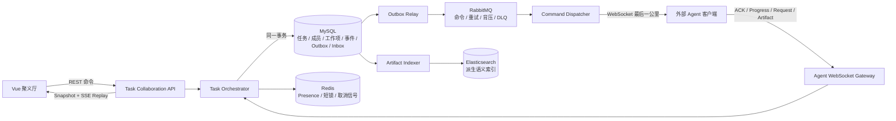
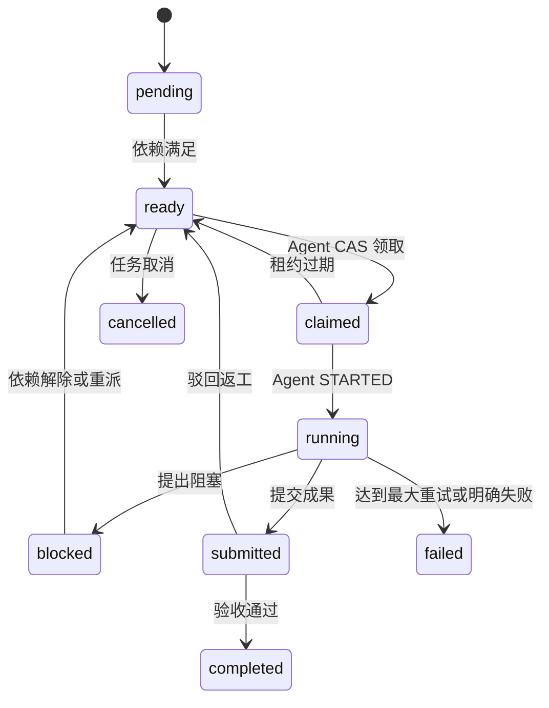

# 聚义厅多 Agent 悬赏协作平台完整方案与详细设计

> 版本：v1.0  
> 日期：2026-07-22  
> 状态：实施基线  
> 适用范围：聚义厅悬赏榜的自动分派、承接、协同、进展共享、诉求协作、成果交付与验收

## 1. 文档目的

本文给出 CYF 当前技术栈下多 Agent 协作能力的目标架构、领域模型、接口协议、消息机制、前端设计、可靠性策略、迁移方案、任务清单和实施计划。

核心结论：

> 采用“数据库优先的任务协作内核 + Outbox/Inbox + RabbitMQ 可靠传输 + WebSocket Agent 网关 + SSE 浏览器事件流”。

RabbitMQ 是可靠传输层，不是任务状态、共享知识或成果的事实源。MySQL 是唯一事实源，Elasticsearch 是可重建的派生索引。

## 2. 当前基线与约束

### 2.1 技术基线

前端：

- Vue 3.5、Vite 6、Pinia、Vue Router、Varlet UI。
- 聚义厅页面：`web/src/components/world/JuyiHall.vue`。
- 聚义厅组件：`web/src/components/juyiting/`。
- 聚义厅逻辑：`web/src/composables/juyiting/`。
- 已有 fetch SSE、断线重连、场景 snapshot 和事件补发能力。

后端：

- Java 21、Spring Boot 4、Spring 7。
- MyBatis-Plus + MySQL。
- Redis/Redisson。
- RabbitMQ/Spring AMQP。
- WebSocket + Reactor/SSE。
- Spring AI、Elasticsearch 记忆实现。
- Camunda 7，但当前不用于聚义厅动态协作。

部署：

- 当前为单个 Spring Boot API 实例。
- Agent 客户端通过 `/ws/agent/channel` 连接 API。
- RabbitMQ 已运行，但尚未建立 Agent 协作交换机、队列、重试和死信体系。

### 2.2 当前主要缺口

1. `agent_task_meta.assigned_agent_id` 用单字段兼容多个 Agent，无法表达成员独立状态。
2. `reportTask()` 会按任务总状态同步整队 Agent，成员报告和任务最终状态混在一起。
3. 缺少 work item、依赖、claim、lease、review 等协作模型。
4. 缺少持久任务事件和浏览器可恢复事件游标。
5. `HallActionDispatcher` 离线 mailbox 在进程内，重启丢失。
6. Agent WebSocket session 和实时 broker 为进程内状态，尚不能直接横向扩容。
7. Agent 客户端忙碌时可能拒绝新消息，缺少可靠本地队列。
8. 缺少 commandId、ACK、Inbox 幂等和端到端投递状态。
9. 普通聊天、任务命令、任务报告的协议语义没有彻底分离。
10. 共享知识检索依赖的 Elasticsearch 当前不宜作为事实源，也缺少任务级 ACL。
11. 多个编码 Agent 共享同一工作目录时存在文件覆盖风险。
12. 数据库 Agent ID 与 runtime Agent ID 存在历史不一致风险。

### 2.3 必须保持的现有约束

- 地图 Agent 继续来自 `/agent/map`。
- 名册 Agent 继续来自 `/agent/roster`。
- 不恢复使用 `/agent/active`。
- 所有任务分派必须显式传递目标 Agent。
- 保留现有任务搜索、推荐、自动分派接口的兼容性。
- 优先复用 `agent_scene_event` 的“持久事件 + after-commit 发布 + SSE replay”模式。

## 3. 范围与非目标

### 3.1 本期范围

- 一个悬赏由多个 Agent 共同承接。
- 自动推荐团队、自动分派工作项。
- Agent 可接受、拒绝、领取、暂停、阻塞、交付和请求帮助。
- 同任务 Agent 共享会话、纪要、进展、诉求和成果。
- 指令可靠投递、ACK、重试、幂等和死信处理。
- 浏览器实时查看任务时间线、成员状态和工作项进度。
- Agent 离线、进程重启和 SSE 断线后可恢复。
- 逐步兼容当前单实例部署，并为后续多实例预留边界。

### 3.2 暂不作为第一阶段目标

- 不把所有动态协作建模成 Camunda BPMN。
- 不实现复杂的通用 DAG 工作流编辑器。
- 不要求第一阶段 RabbitMQ 集群化。
- 不把 Elasticsearch 当事务数据库。
- 不在第一阶段实现 CRDT/多人实时共同编辑同一文件。
- 不允许多个编码 Agent 直接并发修改同一工作树。

## 4. 设计原则

1. **单一事实源**：任务、成员、工作项、事件、成果、投递状态以 MySQL 为准。
2. **命令与事件分离**：命令表示“希望执行”，事件表示“已经发生”。
3. **至少一次投递，业务幂等**：不追求不现实的端到端 exactly-once。
4. **先持久化，再通知**：状态和事件在事务内落库，实时通道只做加速。
5. **可恢复优先**：进程内 broker 丢事件不影响客户端从数据库补发。
6. **显式协作对象**：进展、诉求、成果和验收不是普通聊天文本。
7. **按作用域隔离**：所有数据和事件必须校验 `tenant_id + client_id + task_id`。
8. **渐进迁移**：保留现有 API，使用双写、兼容读取和 feature flag 逐步切换。
9. **解释性自动化**：自动推荐必须返回评分明细和选择原因，人工可覆盖。
10. **基础设施可替换**：领域服务不直接依赖某个消息中间件的业务语义。

## 5. 总体架构



### 5.1 组件职责

| 组件 | 职责 | 不负责 |
| --- | --- | --- |
| Task Orchestrator | 状态机、团队组建、工作项调度、租约、超时重派、验收聚合 | 长连接管理 |
| MySQL | 所有可靠事实和可恢复状态 | 实时 fan-out |
| Outbox Relay | 把已提交领域消息发布到 RabbitMQ | 决定任务状态 |
| RabbitMQ | 命令运输、削峰、重试、死信 | 长期知识和任务真相 |
| WebSocket Gateway | Agent 鉴权、在线连接、命令最后一公里、入站协议 | 离线持久 mailbox |
| SSE | 浏览器任务事件实时流和历史补发 | 写命令 |
| Redis | 在线状态、短生命周期协调、缓存 | 可靠命令存储 |
| Elasticsearch | 成果和知识的语义检索索引 | 原始成果和权限事实 |
| Camunda | 后续固定审批、人工验收、跨天 SLA | 动态 Agent 内部协作核心 |

## 6. 模块边界设计

### 6.1 `api/agent/jia-agent-core`

新增纯领域实体、DTO、枚举：

- `AgentTaskMemberEntity/DTO`
- `AgentTaskWorkItemEntity/DTO`
- `AgentTaskEventEntity/DTO`
- `AgentTaskArtifactEntity/DTO`
- `AgentTaskRequestEntity/DTO`
- `AgentCommandDeliveryEntity/DTO`
- `OutboxEventEntity`
- `ConsumerInboxEntity`
- 命令、事件、状态常量

### 6.2 `api/agent/jia-agent-api`

新增服务接口和端口：

- `AgentTaskCollaborationService`
- `AgentTaskEventService`
- `AgentCommandService`
- `AgentCommandTransport`
- `AgentPresenceService`

`AgentCommandTransport` 作为基础设施抽象，避免领域代码把 RabbitMQ 当状态机。

### 6.3 `api/agent/jia-agent-mapper`

新增：

- 数据库迁移 SQL。
- Entity DAO/Mapper。
- 作用域查询、CAS claim、租约续期、事件连续版本查询。
- Outbox 批量领取和发布状态更新。
- Inbox 唯一键去重。

### 6.4 `api/agent/jia-agent-service`

新增：

- `AgentTaskCollaborationServiceImpl`
- `AgentTaskStateMachine`
- `AgentTeamPlanner`
- `AgentWorkItemScheduler`
- `AgentTaskEventBroker`
- `AgentTaskOutboxRelay`
- 超时/租约扫描任务
- RabbitMQ 发布适配器

逐步把 `AgentServiceImpl` 中任务协作职责迁出，保留兼容门面。

### 6.5 `api/chat/jia-chat-service`

保留并增强：

- `AgentWebSocketHandler`：Agent 协议网关。
- RabbitMQ command consumer：读取命令并调用 WebSocket Gateway。
- Agent 入站 ACK/进展/成果转交给 `AgentTaskCollaborationService`。
- 任务共享会话继续复用现有 `chat_conversation/chat_message`。

替换：

- `HallActionDispatcher` 的内存 mailbox 改为调用持久 `AgentCommandService`。

### 6.6 前端 `web/src`

新增建议：

```text
components/juyiting/
  TaskWorkspacePanel.vue
  TaskMemberBoard.vue
  WorkItemBoard.vue
  TaskTimeline.vue
  TaskRequestPanel.vue
  TaskArtifactPanel.vue
  TaskDispatchDialog.vue

composables/juyiting/
  useTaskWorkspace.js
  useTaskEventStream.js
  useTaskMembers.js
  useTaskWorkItems.js
  useTaskArtifacts.js
```

保留 `JuyiHall.vue` 为页面编排层，不把领域状态机堆回页面组件。

## 7. 领域模型详细设计

### 7.1 任务聚合

`agent_task_meta` 保留为任务级聚合根扩展表。建议增加：

```text
collaboration_mode     single/team
risk_level             low/medium/high
max_agents             最大团队人数
coordinator_agent_id   协调 Agent
review_required        是否需要验收
task_version           乐观锁版本
current_event_version  任务事件最新版本
```

`assigned_agent_id` 进入兼容期：

- 新逻辑不再把它作为成员事实源。
- 双写期内保留首要 Agent 或兼容 JSON。
- 所有新查询以 `agent_task_member` 为准。

### 7.2 任务成员 `agent_task_member`

```sql
CREATE TABLE agent_task_member (
    id BIGINT NOT NULL AUTO_INCREMENT,
    task_id VARCHAR(100) NOT NULL,
    agent_id VARCHAR(100) NOT NULL,
    member_role VARCHAR(20) NOT NULL,
    member_status VARCHAR(20) NOT NULL,
    assignment_source VARCHAR(20) NOT NULL,
    joined_at BIGINT DEFAULT NULL,
    accepted_at BIGINT DEFAULT NULL,
    started_at BIGINT DEFAULT NULL,
    completed_at BIGINT DEFAULT NULL,
    last_heartbeat_at BIGINT DEFAULT NULL,
    failure_reason VARCHAR(1000) DEFAULT NULL,
    version BIGINT NOT NULL DEFAULT 0,
    tenant_id VARCHAR(50) NOT NULL,
    client_id VARCHAR(50) NOT NULL,
    create_time BIGINT DEFAULT NULL,
    update_time BIGINT DEFAULT NULL,
    PRIMARY KEY (id),
    UNIQUE KEY uk_task_member_scope (tenant_id, client_id, task_id, agent_id),
    KEY idx_task_member_agent_status (tenant_id, client_id, agent_id, member_status),
    KEY idx_task_member_task_status (tenant_id, client_id, task_id, member_status)
);
```

成员角色：

- `coordinator`：拆解任务、分配工作项、处理诉求。
- `worker`：执行工作项。
- `reviewer`：验收成果。
- `observer`：可读取但不执行。

成员状态：

```text
invited -> accepted -> working -> done
        -> rejected
                    -> blocked
                    -> failed
                    -> left
```

成员报告只更新自己的成员状态和工作项，不直接完成整项任务。

### 7.3 工作项 `agent_task_work_item`

```sql
CREATE TABLE agent_task_work_item (
    id BIGINT NOT NULL AUTO_INCREMENT,
    work_item_id VARCHAR(100) NOT NULL,
    task_id VARCHAR(100) NOT NULL,
    title VARCHAR(255) NOT NULL,
    description TEXT,
    work_type VARCHAR(30) NOT NULL,
    required_abilities TEXT,
    assignee_agent_id VARCHAR(100) DEFAULT NULL,
    status VARCHAR(20) NOT NULL,
    priority INT NOT NULL DEFAULT 0,
    dependency_json TEXT,
    lease_token VARCHAR(100) DEFAULT NULL,
    lease_until BIGINT DEFAULT NULL,
    attempt_count INT NOT NULL DEFAULT 0,
    max_attempts INT NOT NULL DEFAULT 3,
    result_artifact_id VARCHAR(100) DEFAULT NULL,
    version BIGINT NOT NULL DEFAULT 0,
    tenant_id VARCHAR(50) NOT NULL,
    client_id VARCHAR(50) NOT NULL,
    create_time BIGINT DEFAULT NULL,
    update_time BIGINT DEFAULT NULL,
    PRIMARY KEY (id),
    UNIQUE KEY uk_work_item_scope (tenant_id, client_id, work_item_id),
    KEY idx_work_item_task_status (tenant_id, client_id, task_id, status),
    KEY idx_work_item_assignee_status (tenant_id, client_id, assignee_agent_id, status),
    KEY idx_work_item_lease (status, lease_until)
);
```

状态机：



### 7.4 依赖模型

第一阶段使用 `dependency_json` 保存 work item ID 数组，同时服务层强校验：

- 依赖必须属于同一任务和作用域。
- 禁止自依赖。
- 创建/更新时检测环。
- 仅当所有依赖 `completed` 时从 `pending` 进入 `ready`。

规模增长后再拆为 `agent_task_work_item_dependency` 关系表。

### 7.5 任务事件 `agent_task_event`

```sql
CREATE TABLE agent_task_event (
    id BIGINT NOT NULL AUTO_INCREMENT,
    task_id VARCHAR(100) NOT NULL,
    event_version BIGINT NOT NULL,
    event_id VARCHAR(100) NOT NULL,
    event_type VARCHAR(64) NOT NULL,
    actor_type VARCHAR(20) NOT NULL,
    actor_id VARCHAR(100) DEFAULT NULL,
    aggregate_type VARCHAR(30) NOT NULL,
    aggregate_id VARCHAR(100) NOT NULL,
    event_json MEDIUMTEXT NOT NULL,
    occurred_at BIGINT NOT NULL,
    tenant_id VARCHAR(50) NOT NULL,
    client_id VARCHAR(50) NOT NULL,
    create_time BIGINT DEFAULT NULL,
    update_time BIGINT DEFAULT NULL,
    PRIMARY KEY (id),
    UNIQUE KEY uk_task_event_version (tenant_id, client_id, task_id, event_version),
    UNIQUE KEY uk_task_event_id (tenant_id, client_id, event_id),
    KEY idx_task_event_occurred (tenant_id, client_id, task_id, occurred_at)
);
```

要求：

- 每个任务 `event_version` 单调递增；`agent_task_meta.current_event_version` 等于最新持久事件版本。
- `agent_task_meta.task_version` 继续仅表示任务聚合 CAS 版本，与事件序列分离。
- 状态修改和事件插入在同一事务。
- after-commit 发布到进程内 broker。
- SSE 先订阅 live，再查询并连续补历史，检测缺口后发 `resync_required`。

核心事件：

```text
TASK_CREATED
TEAM_PROPOSED
MEMBER_INVITED
MEMBER_ACCEPTED
MEMBER_REJECTED
WORK_ITEM_CREATED
WORK_ITEM_READY
WORK_ITEM_CLAIMED
WORK_ITEM_STARTED
PROGRESS_REPORTED
HELP_REQUESTED
MEMBER_BLOCKED
ARTIFACT_PUBLISHED
WORK_ITEM_SUBMITTED
REVIEW_REQUESTED
WORK_ITEM_COMPLETED
WORK_ITEM_REQUEUED
COMMAND_DELIVERY_FAILED
TASK_REVIEWING
TASK_COMPLETED
TASK_FAILED
TASK_CANCELLED
```

### 7.6 成果 `agent_task_artifact`

```sql
CREATE TABLE agent_task_artifact (
    id BIGINT NOT NULL AUTO_INCREMENT,
    artifact_id VARCHAR(100) NOT NULL,
    task_id VARCHAR(100) NOT NULL,
    work_item_id VARCHAR(100) DEFAULT NULL,
    producer_agent_id VARCHAR(100) NOT NULL,
    artifact_type VARCHAR(30) NOT NULL,
    title VARCHAR(255) NOT NULL,
    content MEDIUMTEXT,
    storage_uri VARCHAR(1000) DEFAULT NULL,
    content_hash VARCHAR(128) DEFAULT NULL,
    artifact_version INT NOT NULL DEFAULT 1,
    visibility VARCHAR(20) NOT NULL DEFAULT 'task_members',
    metadata_json TEXT,
    created_at BIGINT NOT NULL,
    tenant_id VARCHAR(50) NOT NULL,
    client_id VARCHAR(50) NOT NULL,
    create_time BIGINT DEFAULT NULL,
    update_time BIGINT DEFAULT NULL,
    PRIMARY KEY (id),
    UNIQUE KEY uk_artifact_scope (tenant_id, client_id, artifact_id),
    KEY idx_artifact_task (tenant_id, client_id, task_id, created_at)
);
```

成果类型示例：

- `summary`
- `document`
- `patch`
- `commit`
- `test_report`
- `analysis`
- `dataset`
- `link`

大文件不直接放 MySQL，MySQL 保存元数据、摘要、hash 和 `storage_uri`。

### 7.7 诉求 `agent_task_request`

```text
request_type:
  help               请求协助
  clarification      请求澄清
  dependency         请求解除依赖
  review             请求验收
  resource           请求资源/权限
  reassignment       请求重派
  approval           请求人工批准

status:
  open -> acknowledged -> resolved
       -> rejected
       -> cancelled
```

诉求必须指定：请求人、目标 Agent/角色、关联任务/工作项、优先级、截止时间和结构化响应。

### 7.8 共享会话

不重复建设聊天存储：

- 继续使用现有 `chat_conversation` 和 `chat_message`。
- 新增 `agent_task_thread` 建立任务与会话的显式关系。
- 任务默认创建一个 `team` 会话，可选创建 `review`、`work_item` 子会话。
- 只有任务成员或授权观察者可以读写。
- 关键事实必须同步沉淀为 event/request/artifact，不能只存在于聊天中。

## 8. 任务聚合状态规则

建议任务级状态：

```text
open -> planning -> assigned -> running -> reviewing -> completed
                                     -> blocked
                                     -> failed
                                     -> cancelled
completed/failed/cancelled -> archived
```

兼容期可继续向旧前端映射：

| 新状态 | 旧状态映射 |
| --- | --- |
| planning | open |
| reviewing | running |
| blocked | running |
| cancelled | failed |
| archived | completed/failed 原终态 |

任务状态由服务端聚合，Agent 不可直接声明整个任务完成：

- 存在 `running/claimed/submitted` 工作项：任务至少为 `running`。
- 所有必需工作项 `submitted`：进入 `reviewing`。
- 所有必需工作项 `completed` 且验收通过：任务 `completed`。
- 存在阻塞但仍可恢复：任务 `blocked`。
- 必需工作项达到最大重试且无替代方案：任务 `failed`。
- `completed/failed/cancelled` 只能由 Orchestrator 或授权人工操作产生。

所有状态变更采用乐观锁：

```sql
UPDATE ...
SET status = ?, version = version + 1
WHERE id = ? AND version = ?;
```

更新 0 行表示冲突，返回 HTTP 409，由客户端刷新 snapshot 后重试。

## 9. 自动推荐、组队和分派

### 9.1 自动化等级

| 等级 | 行为 |
| --- | --- |
| L0 | 仅推荐，人工确认分派 |
| L1 | 低风险任务自动分派，关键操作人工确认 |
| L2 | 自动拆解和组队，高风险成果需验收 |
| L3 | 在租户策略和资源上限内自主执行 |

默认从 L0/L1 起步，不直接开放全自动 L3。

### 9.2 候选硬约束

候选 Agent 必须满足：

- 同一 `tenant_id/client_id` 所有权。
- Agent ID 为稳定领域 ID。
- 在线或允许离线排队。
- 非 `error/offline`，或明确允许队列。
- 必需能力满足最低阈值。
- 当前并发工作项低于容量。
- 工作区、工具、权限和数据范围允许。
- 不与任务隔离策略冲突。

### 9.3 推荐评分

第一版延续现有解释性评分并服务端统一：

```text
总分 = 能力匹配 40%
     + 当前可用性 20%
     + 历史成功率 15%
     + 当前负载 15%
     + 最近上下文/领域经验 10%
     - 风险惩罚
```

返回评分明细：

```json
{
  "agentId": "agent-001",
  "score": 86,
  "parts": {
    "ability": 36,
    "availability": 20,
    "success": 12,
    "load": 10,
    "context": 8,
    "riskPenalty": 0
  },
  "matchedAbilities": ["java", "mysql"],
  "reason": "覆盖核心能力，当前空闲，近期同类任务成功"
}
```

### 9.4 多 Agent 组队算法

第一版不引入复杂求解器，使用可解释的贪心覆盖：

1. 按任务或拆解后的工作项生成能力需求集合。
2. 过滤不满足硬约束的 Agent。
3. 每轮选择“新增能力覆盖/成本”最高的 Agent。
4. 达到能力覆盖、最大人数或预算上限后停止。
5. 如仍有关键能力缺口，返回不可自动分派及缺口原因。
6. 高风险任务额外选择独立 reviewer，不能与主要产出者相同。

后续数据量增加后，可升级为带容量、成本和依赖约束的优化问题，但不改变接口。

### 9.5 工作项 claim 与 lease

- Orchestrator 可直接指定 assignee，也允许 Agent 主动 claim。
- claim 使用数据库 CAS，不依赖 Redis 分布式锁。
- claim 成功产生随机 `lease_token` 和 `lease_until`。
- Agent heartbeat 使用 `lease_token` 续期。
- 超时扫描器把未续期工作项重新置为 `ready`，增加 `attempt_count`。
- 原 Agent 迟到提交必须携带 lease token；token 失效则拒绝写入主结果，可保存为候选 artifact 等待人工处理。

## 10. 命令、事件与 Agent 协议

### 10.1 命令信封

```json
{
  "schemaVersion": 1,
  "messageId": "msg-uuid",
  "commandId": "cmd-uuid",
  "correlationId": "task-id",
  "causationId": "event-id",
  "tenantId": "tenant-a",
  "clientId": "client-a",
  "taskId": "task-001",
  "workItemId": "wi-001",
  "targetAgentId": "agent-001",
  "commandType": "WORK_ITEM_EXECUTE",
  "issuedAt": 1784736000000,
  "expiresAt": 1784739600000,
  "attempt": 1,
  "payload": {}
}
```

命令类型：

```text
TASK_INVITE
WORK_ITEM_EXECUTE
WORK_ITEM_RESUME
WORK_ITEM_CANCEL
REQUEST_RESPOND
REVIEW_EXECUTE
CONTEXT_REFRESH
```

### 10.2 Agent 入站消息

```text
COMMAND_ACK
WORK_ITEM_STARTED
WORK_ITEM_HEARTBEAT
PROGRESS_REPORT
HELP_REQUEST
ARTIFACT_PUBLISH
WORK_ITEM_SUBMIT
COMMAND_REJECT
COMMAND_FAIL
```

`agent.message` 仅用于聊天；禁止再隐式转换为 `task.report`。

### 10.3 ACK 层级

| ACK | 含义 |
| --- | --- |
| RECEIVED | Agent 客户端已持久化或放入本地队列 |
| STARTED | Agent 已开始执行 |
| HEARTBEAT | Agent 仍在执行，并续期 lease |
| SUCCEEDED | 命令对应执行完成，不等于整个任务完成 |
| FAILED | 执行失败，可判断是否重试 |
| REJECTED | Agent 因权限、能力、过期或资源不足拒绝 |

WebSocket 写成功只代表 `SENT`，不能当作 `RECEIVED`。

### 10.4 Agent 客户端队列

`/home/isp/apps/codex-ws-agent/agent-client.mjs` 应改为：

```text
收到命令
-> 验证作用域、过期时间和 schemaVersion
-> Inbox 去重
-> 写入本地持久队列
-> 回复 RECEIVED
-> 按 Agent 并发限制取出
-> 回复 STARTED
-> 周期 HEARTBEAT/PROGRESS
-> 发布成果
-> 回复 SUCCEEDED/FAILED
```

建议本地使用 SQLite 或原子 JSONL/目录队列；仅内存数组不能满足进程重启恢复。

## 11. Outbox、Inbox 与投递状态

### 11.1 Outbox

```sql
CREATE TABLE agent_outbox_event (
    id BIGINT NOT NULL AUTO_INCREMENT,
    event_id VARCHAR(100) NOT NULL,
    aggregate_type VARCHAR(30) NOT NULL,
    aggregate_id VARCHAR(100) NOT NULL,
    destination VARCHAR(100) NOT NULL,
    routing_key VARCHAR(100) NOT NULL,
    payload MEDIUMTEXT NOT NULL,
    status VARCHAR(20) NOT NULL,
    attempt_count INT NOT NULL DEFAULT 0,
    next_retry_at BIGINT DEFAULT NULL,
    published_at BIGINT DEFAULT NULL,
    last_error VARCHAR(2000) DEFAULT NULL,
    tenant_id VARCHAR(50) NOT NULL,
    client_id VARCHAR(50) NOT NULL,
    create_time BIGINT DEFAULT NULL,
    update_time BIGINT DEFAULT NULL,
    PRIMARY KEY (id),
    UNIQUE KEY uk_outbox_event_id (tenant_id, client_id, event_id),
    KEY idx_outbox_publish (status, next_retry_at, id)
);
```

业务事务：

```text
更新任务状态
+ 插入 task_event
+ 插入 command_delivery
+ 插入 outbox_event
= 同一 MySQL 事务
```

Relay：

- 分批领取 `pending/retry` 记录。
- 使用 `FOR UPDATE SKIP LOCKED` 或状态 CAS 避免重复领取。
- 开启 Rabbit publisher confirm 和 mandatory return。
- confirm 后标记 `published`。
- 超时或 return 后指数退避。
- 重复发布由下游 Inbox 幂等处理。

### 11.2 服务端 Inbox

```sql
CREATE TABLE agent_consumer_inbox (
    id BIGINT NOT NULL AUTO_INCREMENT,
    consumer_name VARCHAR(100) NOT NULL,
    message_id VARCHAR(100) NOT NULL,
    payload_hash VARCHAR(128) DEFAULT NULL,
    result_status VARCHAR(20) NOT NULL,
    processed_at BIGINT NOT NULL,
    tenant_id VARCHAR(50) NOT NULL,
    client_id VARCHAR(50) NOT NULL,
    PRIMARY KEY (id),
    UNIQUE KEY uk_consumer_message (tenant_id, client_id, consumer_name, message_id)
);
```

处理规则：

- 相同 messageId + 相同 hash：直接返回先前结果。
- 相同 messageId + 不同 hash：安全告警并拒绝。
- Inbox 写入和业务状态变化必须在同一事务。

### 11.3 投递状态

```text
PENDING -> PUBLISHED -> CONSUMED -> SENT -> RECEIVED -> STARTED -> SUCCEEDED
                                -> WAITING_AGENT
                                -> RETRY
                                -> FAILED
                                -> EXPIRED
                                -> DEAD
```

Rabbit consumer 在发现 Agent 离线时：

1. 将 delivery 标记为 `WAITING_AGENT` 并设置 `next_retry_at`。
2. ACK 当前 Rabbit 消息，避免热循环。
3. Agent 重连或重试扫描器重新生成 Outbox 记录。

数据库 delivery 才是离线 mailbox。

## 12. RabbitMQ 详细设计

### 12.1 第一阶段拓扑

```text
Topic Exchange: jia.agent.command
  routing keys:
    agent.command.general
    agent.command.coding
    agent.command.research
    agent.command.review

Queues:
  jia.agent.command.dispatch.q
  jia.agent.command.retry.5s.q
  jia.agent.command.retry.30s.q
  jia.agent.command.retry.5m.q
  jia.agent.command.dlq

Dead Letter Exchange:
  jia.agent.command.dlx
```

不依赖 delayed-message 插件，使用 TTL retry queue + dead-letter routing。

### 12.2 消费语义

- durable exchange/queue。
- persistent message。
- publisher confirm + return。
- consumer manual ACK。
- 合理 prefetch，初始建议 20，根据 Agent 并发再调。
- Rabbit consumer 业务异常先记录 delivery，再决定 ACK/retry/DLQ。
- 消息过期、作用域错误、目标 Agent 不存在直接进入 DEAD/DLQ，不无限重试。

### 12.3 队列粒度

第一阶段不为每个 Agent 创建永久队列。原因：

- Agent 生命周期动态，队列数量和清理成本高。
- 当前 WebSocket Gateway 才是真正连接拥有者。
- 离线可靠性已经由 `agent_command_delivery` 提供。

### 12.4 多实例演进

当前单 API 实例先保持简单。扩容时：

1. Redis 记录 `agentId -> gatewayInstanceId + sessionId + heartbeatAt`。
2. 每个 Gateway 实例声明临时或自动删除实例队列。
3. Dispatcher 根据 presence 把命令路由到对应 Gateway。
4. presence 不存在时写 `WAITING_AGENT`，不猜测广播。
5. 浏览器 SSE 仍从数据库补发，进程内 broker 仅做本实例唤醒。

## 13. SSE 和前端实时状态

### 13.1 接口

```http
GET /agent/tasks/{taskId}/workspace
GET /agent/tasks/{taskId}/events?sinceVersion=123
Last-Event-ID: 123
Accept: text/event-stream
```

`workspace` 返回：

```json
{
  "task": {},
  "members": [],
  "workItems": [],
  "openRequests": [],
  "recentArtifacts": [],
  "conversationId": "...",
  "currentVersion": 128
}
```

SSE 事件 ID 使用 `eventVersion`；workspace 的 `currentVersion` 对应 `current_event_version`，不对应任务聚合 `task_version`。

### 13.2 前端恢复算法

1. 打开任务时读取 workspace snapshot。
2. 保存 `currentVersion`。
3. 连接 SSE，携带 `Last-Event-ID/currentVersion`。
4. 按顺序应用事件。
5. 发现版本不连续或收到 `resync_required`，重新加载 snapshot。
6. SSE 多次失败后进入轮询降级。
7. 页面重新可见时校验版本。

### 13.3 前端状态管理

建议 `useTaskWorkspace()` 维护单一 workspace 状态：

```text
task
membersById
workItemsById
requestsById
artifactsById
timeline
currentVersion
connectionState
```

所有 SSE reducer 必须幂等：`event.version <= currentVersion` 直接忽略。

## 14. REST API 详细设计

### 14.1 团队和分派

```http
POST /agent/tasks/{taskId}/team/recommend
POST /agent/tasks/{taskId}/team/assign
POST /agent/tasks/{taskId}/members/{agentId}/accept
POST /agent/tasks/{taskId}/members/{agentId}/reject
DELETE /agent/tasks/{taskId}/members/{agentId}
```

`team/assign`：

```json
{
  "agentIds": ["agent-001", "agent-002"],
  "coordinatorAgentId": "agent-001",
  "autonomyLevel": "L1",
  "allowOfflineQueue": true,
  "expectedTaskVersion": 12
}
```

### 14.2 工作项

```http
POST /agent/tasks/{taskId}/work-items
PUT /agent/tasks/{taskId}/work-items/{workItemId}
POST /agent/tasks/{taskId}/work-items/{workItemId}/claim
POST /agent/tasks/{taskId}/work-items/{workItemId}/start
POST /agent/tasks/{taskId}/work-items/{workItemId}/heartbeat
POST /agent/tasks/{taskId}/work-items/{workItemId}/progress
POST /agent/tasks/{taskId}/work-items/{workItemId}/submit
POST /agent/tasks/{taskId}/work-items/{workItemId}/review
POST /agent/tasks/{taskId}/work-items/{workItemId}/requeue
```

所有写请求支持：

- `Idempotency-Key`
- `expectedVersion`
- 明确 actor Agent ID，由服务端校验 WebSocket/API Key 所有权

### 14.3 诉求和成果

```http
POST /agent/tasks/{taskId}/requests
POST /agent/tasks/{taskId}/requests/{requestId}/acknowledge
POST /agent/tasks/{taskId}/requests/{requestId}/resolve
GET  /agent/tasks/{taskId}/requests

POST /agent/tasks/{taskId}/artifacts
GET  /agent/tasks/{taskId}/artifacts
GET  /agent/tasks/{taskId}/artifacts/{artifactId}
```

### 14.4 兼容接口

现有接口继续保留：

```http
POST /agent/tasks/{taskId}/assign
POST /agent/tasks/{taskId}/auto-assign
POST /agent/tasks/{taskId}/report
```

兼容行为：

- `assign` 内部转换为团队成员写入和默认工作项分配。
- `report` 必须携带 agentId；转换为成员/工作项报告。
- 单 Agent 兼容任务在唯一工作项完成后自动聚合任务状态。
- 多 Agent 任务中，旧 `report` 不允许直接改变整队终态。

## 15. 共享知识库设计

### 15.1 事实层

近期共享知识来源：

- `agent_task_note`：人工或 Agent 纪要。
- `agent_task_artifact`：正式成果。
- `agent_task_event`：结构化时间线。
- `chat_message`：讨论原文。
- 源码 patch/commit、文件和外部链接。

任务启动时生成 Context Pack：

```text
任务说明
+ 当前成员和角色
+ 工作项及依赖
+ 已接受成果摘要
+ 未解决诉求
+ 最近关键事件
+ 与当前 Agent 相关的会话摘要
```

### 15.2 Elasticsearch 派生索引

待 Elasticsearch 服务、配置和 ACL 完成后：

- 只索引已落 MySQL/文件存储的内容。
- 索引文档必须包含 tenantId、clientId、taskId、artifactId、visibility。
- 查询必须强制过滤作用域和成员权限。
- 索引失败不影响任务事务，进入独立重试。
- 可随时从事实层重建索引。

### 15.3 防止知识污染

- `draft` 成果不自动进入共享 Context Pack。
- `accepted` 成果优先级高于聊天推测。
- 冲突成果同时保留，并标记 `superseded/conflicted`。
- Agent 引用知识时返回 artifactId/eventId，便于追溯。
- 敏感信息、密钥和超大日志在索引前脱敏或拒绝。

## 16. 编码 Agent 工作区策略

每个任务、每个编码 Agent 使用独立 worktree：

```text
/home/isp/hosts/cyf/agent-workspaces/{taskId}/
  coordinator/
  agent-{agentId}/
  reviewer/
```

规则：

- coordinator 创建基线分支。
- 每个 Agent 在独立分支/worktree 修改。
- 交付物是 commit、patch、测试报告，不是共享未提交目录。
- reviewer 或集成 Agent 负责合并、冲突处理和总体验证。
- worktree 创建和清理由受控脚本完成，禁止 Agent 任意覆盖主工作区。
- 任务关闭后按保留策略归档或删除。

## 17. 安全与权限

1. 所有表的作用域查询必须包含 `tenant_id/client_id`。
2. 所有任务读写检查用户或 Agent 是否是成员、所有者或授权观察者。
3. Agent ID 必须使用稳定领域 ID，personaCode/name 仅作为展示属性。
4. WebSocket 注册后只允许代表 session 已授权的 Agent。
5. 禁止向全部 Agent 广播任务内容；只发任务成员或明确目标。
6. command envelope 的 tenant/client/task/targetAgent 由服务端生成，Agent 不可信输入不能覆盖。
7. artifact 设置类型、大小、MIME、URI 白名单和 hash 校验。
8. 日志禁止记录 API Key、完整敏感成果和隐私内容。
9. 高风险动作要求人工 approval request。
10. 管理端重派、取消和强制完成必须写审计事件。

## 18. 可观测性

### 18.1 指标

```text
agent_task_created_total
agent_task_completed_total
agent_task_failed_total
agent_task_duration_seconds
agent_work_item_ready_count
agent_work_item_lease_expired_total
agent_command_delivery_total{status}
agent_command_ack_latency_seconds
agent_outbox_backlog
agent_outbox_oldest_age_seconds
agent_rabbit_publish_failure_total
agent_rabbit_dlq_count
agent_sse_connections
agent_sse_resync_total
agent_artifact_index_failure_total
```

### 18.2 日志关联字段

每条关键日志统一：

```text
traceId
messageId
commandId
eventId
tenantId
clientId
taskId
workItemId
agentId
attempt
```

### 18.3 告警建议

- Outbox 最老未发布记录超过 60 秒。
- 命令 WAITING_AGENT 超过任务 SLA。
- DLQ 出现非零消息。
- SSE resync 比例异常升高。
- work item lease 连续过期。
- Agent ownership 校验失败激增。
- RabbitMQ 磁盘/内存告警或无 consumer。

## 19. 失败场景与处理

| 场景 | 处理 |
| --- | --- |
| DB 成功、MQ 发布失败 | Outbox 保留并重试 |
| MQ 重复投递 | 服务端/Agent Inbox 幂等 |
| MQ 消费后 Agent 离线 | delivery=WAITING_AGENT，ACK MQ，重连后重发 |
| WS send 成功但 Agent 未收到 | 未收到 RECEIVED ACK，超时重发同 commandId |
| Agent 执行中崩溃 | lease 到期，工作项 requeue |
| 旧 Agent 迟到提交 | lease token 失效，保留候选成果但不覆盖主状态 |
| API 重启 | 从 MySQL 恢复；SSE 客户端按版本补发 |
| RabbitMQ 暂停 | 任务状态仍可写入，Outbox 堆积，恢复后发布 |
| Elasticsearch 不可用 | 不影响事务，索引任务重试 |
| 并发领取同一工作项 | CAS 仅一个成功，其余返回 409 |
| 事件历史被清理造成缺口 | SSE 发 `resync_required`，前端重拉 snapshot |
| 多 Agent 成果冲突 | reviewer/integration 工作项处理，不自动覆盖 |

## 20. 数据迁移与兼容方案

### 20.1 数据库迁移

新增迁移文件建议：

```text
api/agent/jia-agent-mapper/src/main/resources/db/task-collaboration-schema.sql
```

同时更新：

- `api/agent/jia-agent-mapper/src/main/resources/db/schema.sql`
- `api/agent/jia-agent-service/src/main/java/cn/jia/agent/config/AgentSchemaInitializer.java`
- `AgentSchemaInitializerTest`

生产部署必须显式执行迁移并验证，不能只依赖 Entity 变更。

### 20.2 历史数据回填

1. 扫描 `agent_task_meta.assigned_agent_id`。
2. 兼容普通字符串和 JSON 数组。
3. 规范化到稳定 Agent ID。
4. 为每个已分配 Agent 写 `agent_task_member`。
5. 单 Agent 历史任务创建一个默认 work item。
6. 写 migration event，保留原字段便于审计。
7. 无法映射的 ID 进入人工修复清单，不静默丢弃。

### 20.3 双写切换

```text
阶段 A：旧表读写 + 新表影子写
阶段 B：新表主读 + 旧字段兼容写
阶段 C：停止旧字段业务写，仅保留兼容展示
阶段 D：确认无旧客户端后移除兼容逻辑
```

使用 feature flags：

```text
agent.collaboration.enabled
agent.task-events.enabled
agent.command-outbox.enabled
agent.rabbit-dispatch.enabled
agent.task-knowledge-index.enabled
```

## 21. 测试策略

### 21.1 后端单元测试

- 任务、成员、工作项状态转换。
- 非法状态转换拒绝。
- 多 Agent 单成员报告不改变整队状态。
- claim CAS 并发测试。
- lease 续期、过期和迟到结果。
- 组队评分与解释性输出。
- task event 连续版本和 gap 处理。
- Outbox 重试和 Inbox 幂等。
- ownership、成员 ACL、跨租户拒绝。

### 21.2 集成测试

- MySQL 事务内状态 + event + outbox 原子性。
- Rabbit publisher confirm/return。
- consumer manual ACK、retry、DLQ。
- Agent 离线后重连补投。
- 相同 commandId 重投只执行一次。
- API 重启后任务、delivery 和 SSE 恢复。

测试 RabbitMQ 可复用 `api/common/jia-common-test` 的 Rabbit 测试基础，并补充 Agent 专用拓扑测试。

### 21.3 前端测试

在现有 `web/tests/juyiting-*` 基础上增加：

- workspace snapshot reducer。
- SSE 连续版本、重复事件和 gap resync。
- 多成员独立状态展示。
- 工作项领取、阻塞、提交和验收动作。
- 诉求创建/处理。
- artifact 列表和权限错误。
- 名册/地图数据边界不受影响。
- 单 Agent 旧任务兼容。

### 21.4 端到端验收场景

1. 自动推荐两个 Agent，人工确认组队。
2. 系统创建两个有依赖的工作项。
3. Agent A 完成前置项并发布成果。
4. Agent B 自动收到依赖解除通知并执行。
5. Agent B 提出帮助请求，协调 Agent 响应。
6. Agent B 执行中断线，重连后不重复执行。
7. reviewer 驳回一次后返工并验收。
8. 浏览器断线重连后时间线无缺失、无重复。
9. API 重启后恢复任务和离线命令。
10. 跨租户 Agent 无法读取或接收任务内容。

## 22. 任务清单

以下估算为人日，不含长期等待时间。

### A. P0 身份、协议和安全地基

| ID | 任务 | 依赖 | 估算 | 验收 |
| --- | --- | --- | ---: | --- |
| A01 | 定义稳定 Agent ID 规则和历史映射 | 无 | 1 | runtime/persona/display ID 边界明确 |
| A02 | 实现身份注册/alias Schema 与历史检测修复 | A01 | 3.5 | SQL、Initializer、约束测试、dry-run 和迁移说明一致 |
| A03 | 拆分 chat、command、progress、result 协议 | A01 | 1.5 | 服务端无歧义分类，普通聊天下行标记为 chat.message |
| A04 | WebSocket 按 tenant/client/task/target 过滤 | A01 | 2 | 不再全量广播任务消息 |
| A05 | Agent 客户端持久 Inbox/队列 | A03 | 3 | 忙碌/重启不丢命令，聊天不发送 task.report/work.result |
| A06 | Agent commandId/ACK/幂等协议 | A03,A05 | 2 | 重复命令只执行一次 |
| A07 | 编码 Agent 独立 worktree 管理脚本 | A01 | 2 | 并发 Agent 不共享可写工作树 |

### B. P0/P1 多人任务领域模型

| ID | 任务 | 依赖 | 估算 | 验收 |
| --- | --- | --- | ---: | --- |
| B01 | 新增 member/work item/request/artifact 表 | A01 | 2 | SQL、Initializer、测试一致 |
| B02 | 新增 Entity/DAO/DTO/Mapper | B01 | 3 | 作用域查询和索引完整 |
| B03 | 实现任务与成员状态机 | B02 | 3 | 非法转换和并发冲突有测试 |
| B04 | 实现 work item claim/lease/heartbeat | B02 | 3 | CAS、续期、过期重派通过 |
| B05 | 实现任务聚合状态计算 | B03,B04 | 2 | 单成员完成不误完成整队 |
| B06 | 实现诉求和成果服务 | B02 | 2.5 | ACL、版本、关联工作项完整 |
| B07 | 建立 task-thread 与共享会话 | B02 | 1.5 | 成员共享且非成员不可访问 |
| B08 | 改造旧 assign/report 兼容层 | B03-B06 | 3 | 旧前端和单 Agent 流程不破坏 |
| B09 | 历史任务成员/工作项回填 | B01,A02 | 2 | 普通 ID/JSON/异常 ID 可处理 |

### C. P1 持久任务事件与 SSE

| ID | 任务 | 依赖 | 估算 | 验收 |
| --- | --- | --- | ---: | --- |
| M2-00 | 基线、dirty/stash、累计 clean base 与资源门禁 | B09 | 0.5 | 不触碰脏 develop，构建前至少 5 GiB |
| C01 | event Schema 和 `event_version` 分配 | M2-00,B02,B03 | 2 | event version 与 aggregate task version 分离 |
| C01B | 全业务写路径状态 + event 原子写入 | C01,B03-B08 | 3 | 成功写路径无漏事件，失败全部回滚 |
| C01H | B09 历史任务 event baseline | C01B,B09 | 2 | 确定性、幂等、可审批、保持 task_version |
| C02 | TaskEventBroker 和 after-commit 唤醒 | C01B,C01H | 2 | 回滚不唤醒，commit 后一次 |
| C03 | 历史 replay、连续性检查、resync | C02 | 3 | 复用 scene event 可靠模式 |
| C04 | workspace snapshot API | C01,C03,B03-B07 | 2.5 | currentVersion=current_event_version |
| C05 | task events SSE API | C03,C04 | 2 | 支持 event-version Last-Event-ID |
| C05F | 后端 M2 feature flag | C05 | 0.5 | 默认关闭，可按测试 scope 开启 |
| C06 | 前端 useTaskEventStream | C04,C05,C05F | 3 | 重连、补发、gap 恢复 |
| C07A | TaskWorkspace 数据和恢复状态接入 | C06 | 1.5 | 单一 workspace 状态源 |
| C07B | TaskWorkspace/Timeline 纯展示 UI | C07A | 1.5 | 可看成员、工作项、诉求、成果 |
| C07C | 响应式、可访问性和组件测试 | C07A | 1 | test/build 通过 |
| C07 | 前端子阶段集成门禁 | C07B,C07C | 0.5 | Juyi Hall 无回归 |
| C07F | 前端 M2 feature flag | C05F,C07 | 0.5 | 默认关闭并可回退 M1 |
| C08A | API 累计 clean base 门禁 | C01-C05F | 0.75 | API 联合回归通过 |
| C08W | Web 累计 clean base 门禁 | C06-C07F | 0.75 | Web test/build 通过 |
| C08 | M2 部署候选最终门禁 | C08A,C08W | 0.5 | 双仓证据完整，GO/NO-GO |

### D. P2 Outbox、投递与 RabbitMQ

| ID | 任务 | 依赖 | 估算 | 验收 |
| --- | --- | --- | ---: | --- |
| D01 | 新增 outbox/inbox/delivery 表 | B01 | 2 | 唯一键和发布索引完整 |
| D02 | 业务事务写 task event + delivery + outbox | C01B,D01 | 3 | 故障注入验证原子性 |
| D03 | Outbox Relay | D02 | 3 | 批量领取、confirm、退避重试 |
| D04 | RabbitMQ exchange/queue/retry/DLQ 配置 | D03 | 2 | durable、manual ACK、TTL DLX |
| D05 | Rabbit command consumer + WS dispatcher | D04,A04 | 3 | 正确目标 Agent 收到命令 |
| D06 | WAITING_AGENT 和重连补投 | D05,A06 | 2.5 | 离线不热循环、不丢命令 |
| D07 | 服务端 Inbox 幂等 | D05 | 2 | 重复消息无重复副作用 |
| D08 | 替换 HallActionDispatcher 内存 mailbox | D01-D06 | 2 | API 重启后 mailbox 仍在 |
| D09 | Rabbit 运维指标、DLQ 查询和重放工具 | D04 | 2 | 可查看、告警、人工重放 |

### E. P2/P3 自动分派和协同

| ID | 任务 | 依赖 | 估算 | 验收 |
| --- | --- | --- | ---: | --- |
| E01 | 统一候选硬约束和评分 | B03 | 2 | 返回评分明细和排除原因 |
| E02 | 多 Agent 贪心组队算法 | E01 | 2.5 | 能力覆盖、人数和 reviewer 约束 |
| E03 | 自动拆解工作项接口和人工确认 | B04 | 3 | 可编辑后再执行 |
| E04 | 依赖解析和 ready 调度 | B04,E03 | 2.5 | 无环、依赖完成后自动解锁 |
| E05 | 超时、失败和重派策略 | B04,D06 | 2.5 | 不无限重试，有人工接管 |
| E06 | 自主等级和风险策略 | E01-E05 | 2 | L0/L1 默认，高风险需审批 |
| E07 | 前端团队推荐/确认/解释 UI | E01,E02 | 3 | 用户可覆盖自动选择 |
| E08 | 前端工作项看板与协作操作 | B04-B06,C06 | 5 | 完成主要协作闭环 |

### F. P3 共享知识与成果整合

| ID | 任务 | 依赖 | 估算 | 验收 |
| --- | --- | --- | ---: | --- |
| F01 | Context Pack 生成器 | B06,B07,C01 | 3 | Agent 收到一致、可追溯上下文 |
| F02 | artifact 文件存储和 hash 策略 | B06 | 2 | 大文件不塞数据库，版本可追溯 |
| F03 | 修复 Elasticsearch 服务和 prod 配置 | 无 | 2 | 健康检查和检索可用 |
| F04 | 任务级 ACL 语义索引 | F01-F03 | 3 | 强制 tenant/client/task 过滤 |
| F05 | 派生索引重试和全量重建工具 | F04,D03 | 2 | ES 清空后可重建 |
| F06 | 成果冲突、accepted/superseded 标记 | B06 | 2 | Context Pack 不混入废弃成果 |

### G. 测试、迁移和运维

| ID | 任务 | 依赖 | 估算 | 验收 |
| --- | --- | --- | ---: | --- |
| G01 | 后端状态机/ACL/幂等测试套件 | B,D | 4 | 核心分支覆盖 |
| G02 | Rabbit 故障注入和恢复测试 | D | 3 | broker/API/Agent 重启可恢复 |
| G03 | 前端协作流测试 | C,E | 3 | reducer、重连、交互覆盖 |
| G04 | E2E 多 Agent 场景 | A-F | 3 | 10 个验收场景通过 |
| G05 | 灰度 feature flags 和回退开关 | B,C,D | 2 | 可逐租户启用 |
| G06 | 数据迁移执行手册 | B09 | 1 | 可验证、可重跑、可审计 |
| G07 | Dashboard 和告警 | D09 | 2 | backlog、DLQ、ACK 延迟可见 |
| G08 | 安全审计和容量压测 | 全部 | 3 | 无越权，容量基线明确 |

## 23. 实施计划

### 23.1 团队假设

以下周期按以下投入估算：

- 后端 2 人。
- 前端 1 人。
- 测试/联调 1 人，可与研发部分兼任。
- Agent 客户端维护 0.5～1 人。

若只有 1 名全栈研发，周期预计扩大到 10～14 周。

### 23.2 推荐里程碑

#### 阶段 0：设计冻结与风险止血，2～3 个工作日

任务：A01、A03、数据库迁移评审、协议评审。

交付：

- 稳定 Agent ID 规范。
- 命令/事件/ACK 协议 v1。
- 表结构和状态机评审通过。
- feature flags 确定。

退出门槛：普通聊天与任务报告语义边界明确。

#### 阶段 1：可靠多人协作 MVP，第 1～2 周

任务：A02、A04～A07、B01～B09。

交付：

- 多成员和工作项模型。
- 成员独立状态。
- work item claim/lease。
- 诉求和成果基础能力。
- 旧 assign/report 兼容。
- Agent 本地队列、ACK 和独立 worktree。

退出门槛：不用 RabbitMQ 也能依靠数据库完成可靠多人协作闭环。

#### 阶段 2：可恢复实时体验，第 3 周

任务：M2-00、C01、C01B、C01H、C02～C05、C05F、C06～C07、C07F、C08A、C08W、C08。

交付：

- 持久 task event。
- workspace snapshot。
- SSE replay/resync。
- 前端任务工作台和时间线。

退出门槛：API 或浏览器重连后无状态丢失，事件可补发。

#### 阶段 3：RabbitMQ 可靠传输，第 4 周

任务：D01～D09。

交付：

- Outbox/Inbox/delivery。
- Rabbit command topology。
- confirm/manual ACK/retry/DLQ。
- 离线 Agent 重连补投。
- 移除进程内 mailbox 事实职责。

退出门槛：RabbitMQ、API、Agent 任一单点短时重启后，命令最终可恢复且不重复执行。

#### 阶段 4：自动分派与高级协同，第 5～6 周

任务：E01～E08、F01、F02、F06。

交付：

- 可解释的团队推荐。
- 自动拆解、组队、依赖调度、超时重派。
- Context Pack。
- 完整成员/工作项/诉求/成果 UI。

退出门槛：真实悬赏可完成“自动推荐 → 组队 → 协作 → 验收 → 完成”全流程。

#### 阶段 5：知识检索与生产加固，第 7～8 周

任务：F03～F05、G01～G08。

交付：

- Elasticsearch 派生索引和 ACL。
- 完整测试与故障恢复演练。
- Dashboard、告警、压测和安全审计。
- 灰度上线和运维手册。

退出门槛：达到生产灰度标准。

### 23.3 可提前上线的三个版本

| 版本 | 时间目标 | 内容 |
| --- | --- | --- |
| MVP-1 | 第 2 周末 | 多 Agent 成员、工作项、ACK、本地队列、独立 worktree |
| MVP-2 | 第 3 周末 | 任务事件、SSE 恢复、前端协作工作台 |
| Beta | 第 4～6 周 | RabbitMQ 可靠投递、自动组队和依赖调度 |
| Production | 第 7～8 周 | 知识索引、压测、安全和可观测性完成 |

## 24. 上线与灰度策略

1. 开发环境启用全部新表，但默认关闭 Rabbit dispatch。
2. 先选择内部测试租户启用 `agent.collaboration.enabled`。
3. 单 Agent 任务走新模型但保持旧 UI，验证兼容性。
4. 开启 task event/SSE，比较 snapshot 与旧查询结果。
5. 开启 Outbox 影子发布，消费者只记录不投递。
6. 开启 Rabbit 实际投递，保留 DB dispatcher 兜底开关。
7. 开启自动组队 L0，仅展示推荐。
8. 逐步开放 L1 低风险自动分派。
9. 高风险任务始终保留人工验收。

回退原则：

- 可以关闭实时、Rabbit 和自动化功能。
- 不回滚已写入的新领域数据。
- 回退到数据库轮询/人工操作，而不是恢复内存 mailbox。

## 25. 完成定义

### 25.1 功能完成

- 同一任务支持多个成员和独立工作项。
- Agent 可以共享上下文、沟通、提出诉求、发布进展和成果。
- 自动推荐可解释，人工可覆盖。
- 任务完成由服务端聚合和验收决定。

### 25.2 可靠性完成

- 忙碌、离线、进程重启不丢命令。
- 重复投递不产生重复副作用。
- RabbitMQ 不可用时业务事实仍可落库。
- 浏览器断线后可按版本恢复。
- work item 超时后可安全重派。

### 25.3 安全完成

- tenant/client/task/agent 四层作用域校验通过。
- 非成员无法读取任务知识或接收任务命令。
- Agent 不能伪造其他 Agent 身份。
- 高风险操作有审计和人工批准路径。

### 25.4 运维完成

- Outbox、delivery、DLQ、ACK 延迟可观测。
- 有迁移、重放、恢复和清理手册。
- RabbitMQ、API、Agent、ES 故障演练通过。

## 26. 最终决策

当前最优方案确定为：

```text
MySQL 协作领域模型和持久事件
+ Outbox/Inbox 可靠边界
+ RabbitMQ 命令运输
+ WebSocket Agent 最后一公里
+ SSE 浏览器可恢复事件流
+ Redis 在线状态和短协调
+ Elasticsearch 派生任务知识索引
```

实施顺序必须坚持：

```text
身份和协议正确性
-> 多成员/工作项领域模型
-> 持久任务事件和 SSE
-> Outbox/Inbox
-> RabbitMQ
-> 自动分派和知识索引
```

这能最大化复用现有 CYF 技术栈，避免引入新的基础设施，同时控制当前单实例、内存 mailbox、Agent ID 不一致和客户端丢消息等风险。
