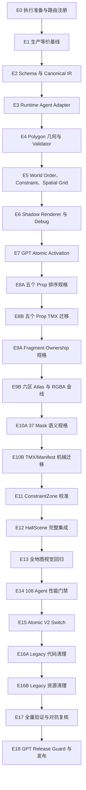

# 聚义厅遮挡系统 V2 完整执行计划与 Agent 分配

**状态：** E0～E18 已完成；已部署并推送 `4127e7a`  
**日期：** 2026-08-14  
**设计依据：** `docs/juyiting-occlusion-system-design.md`  
**实施仓库：** `web/` 独立 Git 仓库  
**目标：** 以交付质量为首要约束，实现全地图可扩展遮挡系统，并通过代码、像素、性能和 GPT 多模态视觉四类门禁完成验证、原子切换、清理和发布。

---

## 0. 2026-08-14 剩余任务模型重路由

GPT 额度恢复后，剩余工作只在高风险裁决和多模态审核使用 GPT；机械验证继续交给低成本模型，避免重复消耗但不降低门禁。

| 阶段 | Owner | 模型 | 职责 |
| --- | --- | --- | --- |
| E17 Evidence | `test_runner` | DeepSeek V4 Flash Medium | 串行复核 build、validator、类型检查、性能 freshness、脚本哈希；不做关键裁决 |
| E17 Adversarial Review | `adversarial_reviewer` | DeepSeek V4 Pro High | 独立攻击 identity、fail-closed、atomic refresh、排序和 provenance；只读 |
| E17/E18 Control Plane | 主 Agent | GPT | 维护权威账本、handoff、安全例外和部署证据，不改已冻结功能实现 |
| E18 V5 Visual | `vision_reviewer` | GPT-5.6 Sol High，多模态 | 最终 12 张 production-equivalent 截图审核；已 `APPROVE` |
| E18 Release Guard | `release_guard` | GPT-5.6 Sol High | 在 E17 accepted 后执行最终 GO/NO-GO；只读 |
| Deploy/Smoke | 主 Agent + `test_runner` | GPT 协调 + DeepSeek V4 Flash | pinned 原子部署、线上深度 smoke、失败回滚、成功后 push |

执行保持 `max_active_tasks=1`、单 Writer、Reviewer 只读。Reviewer 发现 P0/P1/P2 时必须回到对应 Writer 修复并重跑受影响门禁，不能由 Reviewer 顺手修复。

当前候选为 clean `develop` HEAD `4127e7af8fe5c5325d0715fbfc826937f48f41bb`，领先 `origin/develop` 91 commits。完整测试、构建、性能和 V5 视觉证据已通过；剩余关键路径是 E17 独立验收、E18 Release Guard、pinned 部署、线上 smoke 和 push。

## 1. 执行结论

本任务采用以下模型分工：

| 模型 | 主要职责 | 预计任务占比 |
| --- | --- | ---: |
| DeepSeek V4 Pro | 主实现、复杂算法、场景集成、结构化视觉规格落地、复杂修复、独立对抗复核 | 50%～65% |
| DeepSeek V4 Flash | 机械盘点、批量数据录入、脚本执行、测试、截图/叠加图生成、性能采样、报告整理 | 20%～30% |
| GPT | 多模态视觉审核、原子激活/迁移边界、架构例外裁决、最终 Release Guard | 15%～25% |

GPT 正式承担三类质量职责：

1. `vision_reviewer`：读取截图/contact sheet/debug overlay，审核 prop 接触点、fragment 视觉边界、37 mask 语义和全地图最终遮挡；
2. `critical_worker`：实现 staging scene 到 active scene 的原子激活和失败保留逻辑；
3. `release_guard`：执行发布前 migration/release gate，并核对视觉审核问题全部关闭。

设计已经完成 Architect 最终复核并得到“无阻断项”。后续 Architect 仍只处理冻结契约例外；普通视觉审核由独立 GPT `vision_reviewer` 完成。成本控制不得以降低视觉覆盖、跳过复核或让 Writer 自审为代价。

---

## 2. 强制执行规则

### 2.1 串行执行

遵循 `docs/implementation/MODEL_ROUTING.yaml`：

```text
max_active_tasks = 1
one_writer_per_worktree = true
reviewer_read_only = true
writer_reviewer_separation = true
```

任何时刻只允许一个 active task。不能让两个 Agent 同时修改：

- `web/src/game/scenes/HallScene.js`
- `web/src/game/tiledMap.js`
- `web/public/juyiting/hall.tmx`
- 遮挡 atlas/manifest

### 2.2 DeepSeek Writer 身份

当前 `adversarial_reviewer` 虽然使用 DeepSeek V4 Pro，但配置为只读，不能直接作为 Writer。

正式实施前必须采用以下一种方式：

1. 在项目 Agent 配置中增加 `deepseek_pro_worker` 和 `deepseek_flash_worker`；或
2. 使用独立 `worker/default` Agent，并显式指定 `deepseek-v4-pro` 或 `deepseek-v4-flash`。

推荐任务级角色：

```yaml
deepseek_pro_worker:
  model: deepseek-v4-pro
  reasoning_effort: high
  writes_code: true

deepseek_flash_worker:
  model: deepseek-v4-flash
  reasoning_effort: medium
  writes_code: true
  scope: bounded_mechanical_only
```

不得把只读 Reviewer 临时改为可写后再让同一个 Agent 审查自己的代码。

### 2.3 分支和 Worktree

实施代码位于 `web/` 独立 Git 仓库。推荐：

```text
branch: codex/juyiting-occlusion-v2
base: develop
one shared serial worktree
```

每个 Writer 完成任务后必须提交独立 commit，再交给下一 Agent。根目录 `docs/` 在当前环境不属于 `web/` Git 仓库，作为工作区协调文档单独维护。

### 2.4 不得突破的产品和技术边界

- map agents 继续来自 `/agent/map`。
- roster agents 继续来自 `/agent/roster`。
- 不得重新引入 `/agent/active`。
- 不修改 navigation routes、nodes、edges、slots 的业务语义。
- 不允许同一 active scene 混用 v1/v2 对象语义。
- 不允许以临时形象代替延迟加载的人物精灵。
- 不允许用全局 `behindMask`、声明顺序 depth 或新的魔法 depth 修补问题。

---

## 3. Agent 角色表

| 角色 | 模型 | 是否写入 | 适合任务 | 禁止任务 |
| --- | --- | ---: | --- | --- |
| `deepseek_pro_worker` | DeepSeek V4 Pro | 是 | schema、parser、几何、排序、空间索引、HallScene 集成、视觉校准、复杂修复 | 审查自己刚提交的代码 |
| `deepseek_flash_worker` | DeepSeek V4 Flash | 是 | 稳定模板下的 TMX/manifest 录入、fixture、机械测试、脚本补充 | 自主决定遮挡语义、架构、原子激活、复杂算法 |
| `test_runner` | DeepSeek V4 Flash | 否 | build、test、preview、RGBA、benchmark、smoke | 修改代码来让测试通过 |
| `adversarial_reviewer` | DeepSeek V4 Pro | 否 | 循环、partial scene、AABB 假命中、跨 floor/band、资源遗漏、性能退化攻击 | 修复被审查代码 |
| `critical_worker` | GPT | 是 | atomic activation、v1/v2 migration boundary | 普通机械迁移、批量数据录入 |
| `architect` | GPT | 否 | 仅处理冻结契约必须改变的例外 | 正常实现过程中的普通问题 |
| `vision_reviewer` | GPT（多模态） | 否 | contact sheet、截图、debug overlay、接触点/遮挡语义审核 | 修改代码/资产、替代 RGBA/几何测试 |
| `release_guard` | GPT | 否 | 最终迁移和发布门禁 | 日常测试执行、普通修复 |
| Coordinator | 当前主 Agent | 仅必要协调 | 串行调度、handoff、范围控制、验收汇总 | 绕过 Writer/Reviewer 分离 |

### 3.1 GPT 视觉审核契约

`vision_reviewer` 为只读、独立、多模态审核角色，默认使用 GPT 高推理模型。它不生成或编辑生产图片，只输出结构化判定：

```yaml
artifact_set:
scene_region:
subjects:
expected_relation:
observed_relation:
verdict: PASS | FAIL | UNCERTAIN
severity: P0 | P1 | P2 | note
pixel_or_coordinate_evidence:
required_fix:
recheck_scope:
```

强制审核点：

- **V0 基线审核：** E1 的现状截图、历史问题截图和 mask/route overlay；
- **V1 Prop 审核：** E8A 五个 prop 的接触点及四方向探针；
- **V2 Fragment 审核：** E9A 分片边界、像素归属和结构语义；
- **V3 Mask 审核：** E10A 37/37 mask 到视觉结构的映射；
- **V4 全图审核：** E13 每轮九宫区域、六角色、behind/boundary/front 截图矩阵；
- **V5 发布抽检：** E18 production-equivalent 与线上 smoke 截图。

签字规则：

- Flash 只负责生成可复现的截图、contact sheet、编号标注和机器报告，不做最终视觉语义裁决；
- Pro 根据 GPT 审核结论编写规格或修复代码，不得把 `UNCERTAIN` 当作通过；
- GPT 视觉审核与 DeepSeek 对抗审核相互独立，二者都通过才解锁下一阶段；
- GPT 与 Reviewer 结论冲突时，由 Coordinator 生成同坐标、同角色、同缩放的补充证据；仍冲突则提交用户裁决；
- 用户明确指出的视觉事实优先级高于自动审核结论，必须转为回归用例。

`gpt-image-2` 默认预算为 **0**，不得用于 atlas 切片、像素 ownership、RGBA 重建、mask/fragment 验证或普通遮挡修复。只有确实需要新绘/补绘视觉素材时，才在用户明确批准后启用；产物必须使用新 assetRef、SHA-256 和新截图基线，不能覆盖 canonical source。

---

## 4. 总体依赖顺序



所有步骤按箭头串行执行。前一任务未达到 exit gate，后一任务不得开始。

---

## 5. 完整任务分解

## E0：执行准备与路由注册

| 项目 | 内容 |
| --- | --- |
| Owner | Coordinator；durable routing 配置由 Coordinator 维护，功能代码仍由对应 Writer 执行 |
| Reviewer | 独立 `adversarial_reviewer` |
| GPT | 不使用 |
| 目标 | 建立 DeepSeek Writer 角色、分支、worktree、任务账本和 handoff 模板 |
| 写入 | `.codex/config.toml`、`.codex/agents/`、`docs/implementation/MODEL_ROUTING.yaml`，仅在用户批准实施后修改 |
| 交付物 | `deepseek_pro_worker`、`deepseek_flash_worker` 可用；任务分支从最新 `develop` 建立 |
| Exit gate | Writer 和 Reviewer 身份分离；`web/` 工作树干净；基线 commit 已记录 |

当前已注册 `deepseek_pro_worker`、`deepseek_flash_worker` 和 `vision_reviewer`。正式功能实施开始时仍需完成 E0 剩余项：从最新 `develop` 建立分支/worktree、记录基线 commit，并建立任务 ledger/handoff。

## E1：生产等价基线和缺口盘点

| 项目 | 内容 |
| --- | --- |
| Writer | `deepseek_flash_worker` |
| Visual Reviewer | `vision_reviewer`（GPT，多模态，只读） |
| Technical Reviewer | 独立 `adversarial_reviewer` |
| GPT | **必须：V0 基线审核** |
| 目标 | 固定当前 TMX、资产、37 mask、5 prop、测试、网络和视觉基线 |
| 主要路径 | `web/public/juyiting/hall.tmx`、`web/public/juyiting/images/`、`web/tests/fixtures/juyiting/`、`web/scripts/juyiting/` |

任务：

1. 生成 37 mask、5 prop、image layer、collision/nav 数量清单；
2. 记录 canonical source 路径和 SHA-256；
3. 记录两张重复 occluder 资源；
4. 运行现有 map snapshot 和 preview；
5. 保存九宫区域和右上悬赏桌生产等价截图；
6. 记录初始 JS bundle、网络体积、纹理内存和 draw call；
7. 创建迁移 ledger，每个 mask 至少包含 ID、区域、polygon、目标视觉结构、状态。

验证命令：

```bash
cd /home/isp/wsps/cyf/web
npm run validate:juyiting-map
npm run preview:juyiting-map
npm run test -- --grep "Juyiting|HallScene|tiled"
npm run build
```

Exit gate：基线可重复生成；截图和 snapshot 能唯一对应当前已对齐的 dev/prod TMX/资产；GPT V0 明确当前已观察事实、证据缺口和后续必测回归用例。

## E2：Scene Schema 与 Canonical IR

| 项目 | 内容 |
| --- | --- |
| Writer | `deepseek_pro_worker` |
| Reviewer | 独立 `adversarial_reviewer` |
| GPT | 不使用 |
| 目标 | 建立 `renderSchemaVersion=2`、统一 SceneObject IR 和 XML/预解析字节一致输出 |
| 推荐写入 | `web/src/game/occlusion/schema.ts`、`canonicalIr.ts`、`web/src/game/tiledMap.js`、对应测试 |

任务：

- 定义 SceneObject、SceneRender、OccluderFragment、OcclusionConstraintZone；
- 冻结 render band、floor registry、elevation、fixed-point Y、tieBias 和 stableId；
- asset/procedural/无 render 使用判别联合；
- XML 和预解析输入展开默认值并 canonical serialize；
- structured fatal 包含 sceneId、objectId、field、errorCode；
- v1 adapter 只供 shadow path 使用。

Exit gate：XML 与预解析 fixture 的 canonical serialized IR 字节完全一致；缺失 v2 必需字段不产生 partial IR。

## E3：Runtime Agent Adapter

| 项目 | 内容 |
| --- | --- |
| Writer | `deepseek_pro_worker` |
| Reviewer | 独立 `adversarial_reviewer` |
| GPT | 不使用 |
| 目标 | 将 `/agent/map` 数据安全转换为 SceneObject |
| 推荐写入 | `web/src/game/occlusion/runtimeAgentAdapter.ts`、相关 HallAgent/scene adapter 测试 |

任务：

- 原样保存 sourceEntityId；
- 以原始 UTF-8 字节 SHA-256 + lowercase base32 生成 stableId；
- 检查缺失 ID、重复 sourceEntityId 和 stableId 冲突；
- 初始 floor 为 `floor-1/0`；
- chunkId 由可信位置 resolver 推导；
- 普通 snapshot 不得覆盖 floor/elevation、renderBand 或静态资源身份；
- 保持 `/agent/map` 与 roster 数据边界。

Exit gate：相同输入跨运行生成相同 stableId；大小写和 Unicode 不被隐式归一化；非法输入 structured fatal。

## E4：Polygon 几何、3px 迟滞和 Validator

| 项目 | 内容 |
| --- | --- |
| Writer | `deepseek_pro_worker` |
| Reviewer | 独立 `adversarial_reviewer` |
| GPT | 不使用 |
| 目标 | 用真实 polygon 替换 AABB-only 判断 |
| 推荐写入 | `web/src/game/occlusion/polygonGeometry.ts`、`validation.ts`、对应单元测试 |

任务：

- 1/256 世界像素 canonical fixed-point；
- even-odd containment 和精确边界；
- 到 polygon 边线段的最小欧氏 signed distance；
- outside→inside `>=+3px`，inside→outside `<=-3px`；
- 退化边、自相交、面积过小 fatal；
- erosion(-3px) 无有效内部区域 fatal；
- AABB 仅作 broad phase。

Exit gate：内部、外部、边界、AABB 内 polygon 外、凹角、顶点和 ±3px 临界测试全部通过。

## E5：World Order、Constraint Resolver 与 Spatial Grid

| 项目 | 内容 |
| --- | --- |
| Writer | `deepseek_pro_worker` |
| Reviewer | 独立 `adversarial_reviewer` |
| GPT | 不使用 |
| 目标 | 建立统一稳定排序和稀疏约束图 |
| 推荐写入 | `worldOrder.ts`、`constraintResolver.ts`、`spatialGrid.ts`、对应测试 |

任务：

- 实现唯一排序键；
- 对全部 active `world` 对象执行稀疏边 Kahn；
- priority 降序 + stableId 字节序；
- behind=`agent<fragment`，front=`fragment<agent`；
- target 必须 world band；agent/zone/target 必须同 scene/floor；
- 冲突和循环 structured fatal；
- 空间网格只负责 zone/fragment 候选发现；
- instrumentation 统计候选数、边数、排序耗时和全图扫描异常。

Exit gate：无 constraint 时等于基础全序；两个人可同时位于同一 fragment 两侧；循环不允许 stable fallback。

## E6：Shadow Renderer、Debug Overlay 和回归钩子

| 项目 | 内容 |
| --- | --- |
| Writer | `deepseek_pro_worker` |
| Evidence operator | `test_runner` 执行验证，不拥有签字权 |
| Reviewer | 独立 `adversarial_reviewer`，为唯一 review 签字人 |
| GPT | 不使用 |
| 目标 | v2 只计算不接管画面，和 v1 输出并行对比 |
| 推荐写入 | `web/src/game/occlusion/shadowRenderer.ts`、debug 模块、`HallScene.js` 最小接线 |

任务：

- v1 active、v2 shadow；
- 输出每个对象 v1 depth、v2 sort key、constraint edge 和差异；
- `?jytOcclusionDebug=1` 显示脚点、fragment、zone、cell 和错误；
- production overlay 关闭，只保留低成本计数器；
- camera、hit-test、pointer、lighting/UI 不受 shadow path 影响。

Exit gate：关闭 debug 时页面行为与基线一致；shadow path 的 fatal 不会污染 active v1 scene。

## E7：Atomic Activation 最小模块

| 项目 | 内容 |
| --- | --- |
| Writer | `critical_worker` |
| 模型 | GPT，仅此核心写入任务 |
| Reviewer | `adversarial_reviewer`（DeepSeek V4 Pro，只读） |
| 目标 | 实现 staging→active 原子激活和失败保留 |
| 推荐写入 | `web/src/game/occlusion/sceneActivation.ts` 及事务测试；避免扩大到普通排序和 TMX 数据 |

GPT 输入必须压缩为：冻结设计契约、E2～E6 API、目标文件和失败用例，不重新让 GPT阅读全部历史讨论。

任务：

```text
parsed
→ canonicalized
→ validated
→ assetsReady
→ instantiated in staging
→ atomic active commit
```

必须保证：

- 任何阶段失败不展示 partial scene；
- 已有 active scene 时保留上一完整场景；
- 无 active scene 时显示完整错误态；
- 帧事务失败保留上一完整排序和 depth；
- v1/v2 以整图为单位切换。

Exit gate：故障注入覆盖 parser、validator、asset load、instantiate、constraint cycle 和 commit；均无半张地图。

## E8A：五个 Prop 排序规格

| 项目 | 内容 |
| --- | --- |
| Writer | `deepseek_pro_worker` |
| Visual Reviewer | `vision_reviewer`（GPT，多模态，只读） |
| Technical Reviewer | 独立 `adversarial_reviewer` |
| GPT | **必须：V1 视觉签字** |
| Commit boundary | 五个 prop 的 machine-readable sort spec 和验收探针独立 commit |

任务：

- 为五个 prop 冻结 stableId、floor、elevation、renderBand、sortMode 和 sortAnchor；
- 不直接把图片矩形底边当最终接触点；
- 为每个 prop 定义上、下、左、右四方向探针；
- 为右上桌子冻结 `table < agent` 关系；
- 输出 Flash 可机械执行的规格，不留视觉语义判断空白。

Exit gate：五项规格经 GPT V1 视觉签字和独立 Technical Reviewer 签字；声明顺序和插入顺序测试已定义。

## E8B：五个 Prop TMX/Manifest 迁移

| 项目 | 内容 |
| --- | --- |
| Writer | `deepseek_flash_worker` |
| Reviewer | 独立 `adversarial_reviewer` |
| GPT | 不使用 |
| Preconditions | E8A commit 和 review 已完成 |
| Commit boundary | TMX、manifest、snapshot 和 prop 定向测试独立 commit |

任务：

- 严格按 E8A 规格录入五个 prop；
- 更新 parser fixture 和 snapshot；
- 运行上、下、左、右探针；
- 不自行调整 sortAnchor 或 renderBand；规格不一致时停止并退回 E8A。

Exit gate：五个 prop 全部通过四方向测试；右上桌子满足 `table < agent`；声明顺序和插入顺序不影响结果。

## E9A：Fragment Ownership 与 Atlas 输入规格

| 项目 | 内容 |
| --- | --- |
| Writer | `deepseek_pro_worker` |
| Visual Reviewer | `vision_reviewer`（GPT，多模态，只读） |
| Technical Reviewer | 独立 `adversarial_reviewer` |
| GPT | **必须：V2 视觉签字** |
| Commit boundary | 必须独立 commit，E9B 只能基于该 commit 开始 |
| 推荐写入 | committed machine-readable fragment ownership spec、manifest schema、对应校验测试 |

固定 canonical source：

```text
assetRef: jyt.occlusion-source.hall-v3
path: web/public/juyiting/images/liangshan-hall-mid-occluders-v3.webp
sha256: 3e4f3f90b4d84411a844978237a7d3530bd481c37a62bcd73b9d694a7d2dd432
```

任务：

- 决定每个 fragment 的 sourceRect、destinationRect、chunk、stableId 和唯一 pixel ownership；
- 决定 center、west-upper、west-lower、east-upper、east-lower、entrance 六区边界；
- 定义 lossless WebP/PNG 输出约束；
- 提供机器可读输入，使 Flash 不需要自行判断视觉语义；
- 为 ownership overlap、越界和遗漏建立失败测试。

Exit gate：规格经 GPT V2 视觉签字，测试经独立 Technical Reviewer 签字；所有 canonical 非透明像素都有且只有一个预期 owner。

## E9B：六区 Atlas 生成和 RGBA 金线

| 项目 | 内容 |
| --- | --- |
| Writer | `deepseek_flash_worker` |
| Reviewer | 独立 `adversarial_reviewer`；E9A Writer 不得作为唯一 Reviewer |
| GPT | 不使用 |
| Preconditions | E9A commit 和 review 已完成 |
| Commit boundary | 生成脚本、manifest 和最终资产独立 commit |
| 推荐写入 | `web/scripts/juyiting/generate-occluder-atlases.mjs`、`validate-occlusion-assets.mjs`、`web/public/juyiting/images/occluders/` |

任务：

- 严格按 E9A machine-readable spec 生成六区资源；
- 只使用 lossless WebP 或 PNG；
- fragment 重建平面与 canonical decoded RGBA 逐像素、逐通道相同；
- 输出 manifest、资源 hash、体积和 ownership 报告；
- 不自行移动 fragment 边界；规格有误则停止并退回 E9A 新 commit。

Exit gate：RGBA exact match；无重复加深、漏像素或采样接缝；网络体积有对比报告。

## E10A：37 Mask 视觉语义与迁移规格

| 项目 | 内容 |
| --- | --- |
| Writer | `deepseek_pro_worker` |
| Visual Reviewer | `vision_reviewer`（GPT，多模态，只读） |
| Technical Reviewer | 独立 `adversarial_reviewer` |
| GPT | **必须：V3 视觉签字** |
| Commit boundary | 37 项机器可读 ledger 独立 commit，E10B 只能基于该 commit 开始 |

任务：

- 为每个旧 mask 指定视觉结构、target fragment、sortAnchor 和是否需要 constraint；
- 为每项定义 stableId、scene/floor/chunk scope；
- 为每项定义 behind/boundary/front 探针；
- 明确哪些旧 polygon 需要重新校准；
- 输出 37/37 committed machine-readable migration ledger。

Exit gate：GPT V3 对九宫区域和 37 项视觉映射签字，Technical Reviewer 对完整性和契约签字；无“由 Flash 自行判断”的语义空白。

## E10B：TMX/Manifest 机械迁移

| 项目 | 内容 |
| --- | --- |
| Writer | `deepseek_flash_worker` |
| Reviewer | 独立 `adversarial_reviewer` |
| GPT | 不使用 |
| Preconditions | E10A commit 和 review 已完成 |
| Commit boundary | TMX、manifest、snapshot 和 preview 更新独立 commit |
| 主要路径 | `hall.tmx`、fragment manifest、map snapshot、debug preview |

任务：

1. 严格按 E10A ledger 批量写入 stableId、scope、polygon 和 reference；
2. 更新 snapshot、preview 和机械 validator fixture；
3. 不改变 sortAnchor、relation 或 fragment ownership；
4. ledger 与 TMX 不一致时停止，不猜测修复。

Exit gate：迁移 ledger 为 37/37；每项有 behind/boundary/front 探针；无匿名生产 occluder；Reviewer 确认 TMX 与 E10A 规格逐项一致。

## E11：OcclusionConstraintZone 校准

| 项目 | 内容 |
| --- | --- |
| Writer | `deepseek_pro_worker` |
| Reviewer | `adversarial_reviewer` |
| GPT | 不使用 |

只为继续拆 fragment 仍无法表达的区域添加 constraint。任务包括：

- targetFragmentId；
- relation、priority、scope；
- 3px signed-distance 迟滞；
- opposite relation overlap 检查；
- static、activation 和 runtime cycle 测试；
- 多 Agent 同时位于目标两侧。

Exit gate：不存在全局人物状态修改；约束只影响当前 agent/target pair；target 不得是 overhead。

## E12：HallScene 完整集成

| 项目 | 内容 |
| --- | --- |
| Writer | `deepseek_pro_worker` |
| Reviewer | `adversarial_reviewer` |
| GPT | 不使用；不得修改 E7 冻结的 atomic contract，除非触发例外流程 |
| 主要路径 | `web/src/game/scenes/HallScene.js`、`tiledMap.js`、resources、HallAgent 接线 |

任务：

- agent、prop、fragment 进入统一 world order；
- lighting/world-ui/screen-ui 保持独立；
- 连续整数 depth 原子提交；
- pointer hit-test 继续使用最终视觉顺序；
- 延迟精灵加载继续使用真实人物资源，不使用临时形象；
- 不删除 v1，仍由 activation gate 控制 active renderer。

Exit gate：v2 staging 可完整实例化；v1/v2 不混用；所有现有交互测试通过。

## E13：全地图视觉校准

| 项目 | 内容 |
| --- | --- |
| Operator | `test_runner`（Flash）生成截图/contact sheet/overlay |
| Fix Writer | `deepseek_pro_worker` |
| Visual Reviewer | `vision_reviewer`（GPT，多模态，只读） |
| Technical Reviewer | 独立 `adversarial_reviewer` |
| GPT | **必须：每轮 V4 审核** |

覆盖：

```text
西北、北中、东北
西中、中央、东中
西南、南中、东南
```

每个目标至少验证：behind、boundary、front。重点角色：宋江、卢俊义、扈三娘、李逵、林冲、吴用。重点区域：右上悬赏桌、栏杆、柱子、书架、前门结构。

同时回归：

- camera zoom/pan/resize；
- desktop/mobile/pinch；
- agent hit-test 和 hotspot pointer routing；
- labels/bubbles 始终在 world-ui；
- lighting 不被 world sort 改写。

迭代规则：

- 一轮定义为：Flash 生成完整截图/contact sheet → GPT Vision Reviewer 输出逐图结构化判定 → Pro 提交一个修复 commit（如需）→ Flash 重新生成完整受影响矩阵 → Technical Reviewer 检查契约与回归；
- 最多 3 轮，不允许无限循环；
- 任一 `FAIL` 必须绑定截图编号、角色、世界坐标、目标 fragment/prop 和复查范围；
- 第 3 轮仍未通过时立即停止后续任务，提交 visual exception report；若需要改变冻结排序/资源契约，进入 GPT Architect 例外流程，否则请求用户批准额外工期后再继续。

Exit gate：3 轮以内九宫截图矩阵经 GPT V4 和 Technical Reviewer 双签字；无已知遮挡穿帮。

## E14：108 Agent 性能门禁

| 项目 | 内容 |
| --- | --- |
| Operator | `test_runner`（Flash） |
| Optimization Writer | `deepseek_pro_worker` |
| GPT | 不使用 |

固定基准：

```text
production build
当前测试/部署主机
Chromium harness
1664×928
108 agents
50 fragments
37 zones
10 秒预热
60 秒采样
```

门禁：

```text
world ordering + spatial-index update
p95 ≤ 2.0 ms
p99 ≤ 4.0 ms
```

还必须证明：

- 不存在 `agents × all-map fragments/zones` 扫描；
- 无持续 GC 抖动；
- 网络、JS heap、texture memory、draw call 有基线对比。

迭代规则：

- 一轮定义为：Flash 完整 10s+60s 采样 → Pro 提交一个有 profile 证据的优化 commit → Flash 重新完整采样；
- 最多 3 轮，不允许缩短采样时间冒充通过；
- 第 3 轮仍失败时停止 E15，提交 performance exception report；若必须改变排序契约或作用域，进入 GPT Architect 例外流程，否则请求用户批准额外性能工期。

Exit gate：3 轮以内固定 benchmark 报告可重复通过。

## E15：Atomic V2 Switch

| 项目 | 内容 |
| --- | --- |
| Writer | `deepseek_pro_worker` 仅做接线和配置 |
| Contract Owner | E7 的 GPT atomic module，不允许私自改变语义 |
| Reviewer | `adversarial_reviewer` |
| GPT | 默认不使用；只有满足下述全部触发条件才可使用 E7 剩余预算 |

GPT 重新进入 E15 的必要条件必须全部满足：

1. Pro 提供失败测试，证明 E7 的公开 API/前置条件/提交语义无法表达 melonJS 实际生命周期，而不是普通接线 bug；
2. 典型触发仅限：`activate(scene)` 无法表达 `me.state.change` 的两阶段提交、staging entity 生命周期无法在 commit 前隔离、或 rollback contract 缺少必要状态；
3. 独立 `adversarial_reviewer` 确认必须改变 E7 contract；
4. Coordinator 向用户说明所需 API delta 并取得批准；
5. GPT 输入仅包含 E7 API、失败测试、相关 melonJS 本地实现/文档和目标文件，不提供全部历史上下文；
6. E7+E15 合计不得超过 §7 的 50K token 上限。

不满足以上条件时，一律由 Pro 修复普通集成问题，不调用 GPT。

任务：

- staging 通过全部 gate 后启用 `renderSchemaVersion=2`；
- 整张场景一次切换；
- 故障时保留上一 active scene；
- production-equivalent screenshot 作为唯一视觉基线。

Exit gate：故障注入、刷新、重复激活、资源失败和 cycle 均不产生 partial scene。

## E16A：Legacy Runtime 和测试语义清理

| 项目 | 内容 |
| --- | --- |
| Writer | `deepseek_pro_worker` |
| Reviewer | 独立 `adversarial_reviewer` |
| GPT | 不使用 |
| Commit boundary | runtime/test 逻辑清理独立 commit |

删除：

- 全局 `behindMask` 双 depth 公式；
- `propDepth += 0.5`；
- 不再引用的 v1 runtime 分支；
- 已被 v2 测试替代的 legacy 语义 fixture。

不得删除 navigation、routes、slots、lighting、world-ui 或 atomic activation 错误态基础设施。

Exit gate：`rg` 不再发现生产 legacy depth 路径；功能和交互测试全部通过。

## E16B：Legacy 资源和引用机械清理

| 项目 | 内容 |
| --- | --- |
| Writer | `deepseek_flash_worker` |
| Reviewer | 独立 `adversarial_reviewer` |
| GPT | 不使用 |
| Preconditions | E16A commit/review 完成，并提供已签字资源删除清单 |
| Commit boundary | 资源文件和资源声明清理独立 commit |

删除：

- 重复 foreground occluder legacy 资源；
- 已确认无引用的 v1 asset declaration；
- superseded、未引用的临时 atlas/fixture。

不得删除 canonical source、lighting/world-ui 资源或任何仍由 production build 引用的资产。Flash 只执行签字清单，发现额外候选时停止并回报。

Exit gate：production build 不引用重复资源；资源 404 检查和 canonical SHA-256 门禁通过。

## E17：全量验证和独立复核

### E17-A Flash Test Runner

```bash
cd /home/isp/wsps/cyf/web
npm run validate:juyiting-map
npm run preview:juyiting-map
npm run validate:juyiting-sprites
npm run typecheck:game
npm run test:game
npm run test
npm run build
```

并执行：

- RGBA exact validator；
- Chromium 固定 benchmark；
- 九宫截图；
- public-beta preflight/UI smoke；
- dev 环境完整交互 smoke。

### E17-B DeepSeek V4 Pro Adversarial Review

必须攻击：

- AABB 内 polygon 外假命中；
- 两 Agent 位于 fragment 两侧；
- opposite relation overlap；
- static/runtime cycle；
- target 指向 overhead；
- 跨 scene/floor edge；
- asset/procedural render 字段缺失；
- partial scene；
- camera/pointer 回归；
- 全图扫描和性能统计失真；
- atlas 像素重复或遗漏。

Reviewer 只报告，不修改。修复由对应原 Writer 完成，然后 E17-A/E17-B 重新执行。

Exit gate：Reviewer 无 P0/P1/P2 未解决问题，测试和构建全部通过。

## E18：GPT Release Guard、部署和线上验证

| 项目 | 内容 |
| --- | --- |
| Reviewer | `release_guard`（GPT，只读） |
| GPT token 控制 | 只提供最终 diff、设计门禁摘要、测试/性能报告、GPT V0～V4 视觉报告、截图索引和残余风险，不提供全部历史对话 |
| 发布执行 | Coordinator/现有部署流程 |

Release Guard 检查：

- v1/v2 是否混用；
- atomic activation 是否真实生效；
- canonical IR、RGBA 和性能门禁是否有证据；
- legacy 删除是否误伤；
- 所有引用和资源是否完整；
- GPT V0～V4 视觉问题是否全部关闭；
- 是否具备生产发布条件。

通过后先执行 release integration：

1. 确认 feature branch 的所有变更均已提交；
2. 获取最新 `origin/develop`；若基线变化，rebase/解决冲突后重新执行 E17；
3. 本地 `develop` 只允许 fast-forward 到已通过 Release Guard 的 commit；
4. 在本地 `develop` 再运行 build 和关键 smoke；
5. 不先 push，使用本地已提交的 `develop` 执行部署；
6. 部署和线上 smoke 成功后再 push `origin/develop`。

```bash
cd /home/isp/wsps/cyf/web
git fetch origin
git checkout develop
git merge --ff-only codex/juyiting-occlusion-v2
npm run build
bash /home/isp/bin/cyf_web_kit_start.sh
curl -k -sS -o /tmp/cyf-kit-index.html \
  -w '%{http_code} %{size_download}\n' \
  https://kit.chaoyoufan.cn/
```

如果 `--ff-only` 失败，不允许临时 merge 后直接部署；返回 feature branch 对最新 `origin/develop` 做 rebase，并重跑 E17 和 Release Guard。

再完成线上：

- 聚义厅加载；
- 右上悬赏桌遮挡；
- 六角色移动，并生成 V5 发布抽检截图；
- hotspot 点击；
- zoom/pan/mobile；
- 资源 404 和控制台 fatal；
- 性能快速 smoke。

发布和 smoke 成功后执行 `git push origin develop`。失败则不 push、不宣布成功，由对应 Writer继续修复；若部署已覆盖线上，使用部署脚本现有备份恢复完整上一版本并继续修复，不做半版本文件级回退。

---

## 6. Agent 分配总表

| Task | 任务 | Writer/Operator | Reviewer | GPT 使用 | 预计工作量 |
| --- | --- | --- | --- | --- | ---: |
| E0 | 路由、分支、handoff 初始化 | Pro | adversarial reviewer | 无 | 0.25 d |
| E1 | 基线、37 mask/5 prop 清单 + V0 | Flash | GPT vision + adversarial reviewer | **视觉必须** | 0.5～0.75 d |
| E2 | Schema 与 canonical IR | Pro | adversarial reviewer | 无 | 0.75～1 d |
| E3 | Runtime Agent Adapter | Pro | adversarial reviewer | 无 | 0.5 d |
| E4 | Polygon/signed-distance validator | Pro | adversarial reviewer | 无 | 0.75～1 d |
| E5 | World order/Kahn/spatial grid | Pro | adversarial reviewer | 无 | 0.75～1 d |
| E6 | Shadow renderer/debug | Pro | Flash test + adversarial reviewer | 无 | 0.5～0.75 d |
| E7 | Atomic activation | GPT critical_worker | adversarial reviewer | **必须** | 0.5～0.75 d |
| E8A | 五 prop 排序规格 + V1 | Pro | GPT vision + adversarial reviewer | **视觉必须** | 0.25～0.5 d |
| E8B | 五 prop TMX/manifest 迁移 | Flash | adversarial reviewer | 无 | 0.25 d |
| E9A | Fragment ownership 规格 + V2 | Pro | GPT vision + adversarial reviewer | **视觉必须** | 0.5～0.75 d |
| E9B | 六 atlas/RGBA 脚本和产物 | Flash | adversarial reviewer | 无 | 0.5～1 d |
| E10A | 37 mask 语义规格 + V3 | Pro | GPT vision + adversarial reviewer | **视觉必须** | 0.5～0.75 d |
| E10B | TMX/manifest 机械迁移 | Flash | adversarial reviewer | 无 | 0.5～0.75 d |
| E11 | ConstraintZone | Pro | adversarial reviewer | 无 | 0.5～1 d |
| E12 | HallScene 集成 | Pro | adversarial reviewer | 无 | 0.75～1 d |
| E13 | 全图视觉校准 V4（最多3轮） | Flash 截图 ↔ Pro 修复 | GPT vision + adversarial reviewer | **每轮必须** | 1.25～2.5 d |
| E14 | 性能门禁（最多3轮） | Flash 采样 ↔ Pro 优化 | adversarial reviewer | 无 | 0.5～1 d |
| E15 | Atomic v2 switch | Pro 接线 | adversarial reviewer | 条件使用 | 0.25～0.5 d |
| E16A | Legacy runtime/test 清理 | Pro | adversarial reviewer | 无 | 0.25～0.5 d |
| E16B | Legacy 资源/引用清理 | Flash | adversarial reviewer | 无 | 0.25 d |
| E17 | 全量验证和对抗复核 | Flash test_runner | adversarial reviewer | 无 | 0.5～1 d |
| E18 | V5/Release Guard/发布 | Coordinator | GPT vision + release_guard | **必须** | 0.5～0.75 d |
|  | **合计（23 个任务 ID）** |  |  |  | **约 11.75～18.75 agent-day** |

说明：设计文档中的 6.5～10 agent-day 是纯实现估算；本表把路由准备、独立审查、GPT 多模态视觉门禁、重复截图、完整性能采样和发布门禁单独计入，因此采用更保守的 11.75～18.75 agent-day。若资源切片无需返工，预计接近下限。

---

## 7. GPT Token 控制方案

### 7.0 默认硬预算

未经用户再次批准，本计划的 GPT 自动预算固定为：

| GPT 任务 | Token 硬上限 | 调用轮次上限 |
| --- | ---: | ---: |
| V0～V5 GPT Vision Review | 70,000 | 6 个门禁；E13 最多 3 轮 |
| E7 Atomic Activation（含可能的 E15 contract 补充） | 50,000 | 初始实现 1 轮 + 修正最多 1 轮 |
| E18 Release Guard | 25,000 | 正式审查 1 轮 + 澄清最多 1 轮 |
| GPT Architect 例外 | 0（默认禁用） | 必须用户单独批准预算 |
| `gpt-image-2` | 0（默认禁用） | 仅新绘/补绘资产且需用户明确批准 |
| **默认总上限** | **145,000** | 超限前报告；不得静默降级质量门禁 |

规则：

- E15 没有独立预算，只能使用 E7 未消耗部分，且 E15 自身最多使用 15,000 tokens；
- 任一任务接近上限时先压缩输入、复用 contact sheet 和缩小复查范围，不得跳过必须门禁或通过新开 GPT Agent 绕过预算；
- 超出单项或总上限前，Coordinator 必须报告已用量、剩余工作和替代方案，并获得用户明确批准；
- 若平台不能提供精确 usage，以提交给 GPT 的输入 token 估算加输出上限控制，同时严格执行调用轮次上限。

### 7.1 GPT 只接收压缩上下文

E7 输入限定为：

- 设计文档中 activation/transaction 相关章节；
- E2～E6 已冻结的 API；
- 目标文件；
- 必须通过的故障注入测试；
- 当前 diff，而不是全部历史讨论。

Vision Review 输入限定为：

- 带编号的 contact sheet 或同坐标前后对比图；
- 对应角色、世界坐标、目标 prop/fragment/mask stableId；
- debug overlay 中的 sortAnchor、polygon、constraint 和最终排序关系；
- 上一轮问题列表及本轮关闭证据；
- 不提供与当前视觉判定无关的全仓代码。

E18 输入限定为：

- 最终变更文件列表和 diff 摘要；
- 测试/构建报告；
- RGBA 报告；
- benchmark 报告；
- 截图索引；
- Reviewer 问题及关闭状态；
- 残余风险。

### 7.2 GPT Architect 触发条件

只有以下情况允许额外消耗 GPT：

1. 必须改变六个 render band；
2. 必须改变排序键顺序；
3. 全 active-world 稀疏 Kahn 无法满足性能门禁；
4. atomic activation API 不能表达实际 melonJS 生命周期；
5. floor/elevation 规则无法表达新增地图结构；
6. 需要降低 fatal 或 RGBA hard gate。

普通 bug、测试失败和性能优化由 DeepSeek V4 Pro 解决；视觉偏差由 GPT Vision Reviewer 判定、DeepSeek V4 Pro 修复，不能由实现 Writer 自行宣布通过。

### 7.3 GPT 预算不足的应急方案

如果 GPT token 连 E7 都无法覆盖，必须由用户显式批准 task-specific routing exception：

```text
DeepSeek V4 Pro Writer-A 实现 atomic activation
→ 独立 DeepSeek V4 Pro adversarial_reviewer 对抗审查
→ 由不同 session 的 Pro Writer-B 执行 E12/E15 集成
→ 再做一次独立对抗审查
→ 保留最少 GPT token 做最终 Release Guard
```

这不是默认方案，因为它偏离当前 migration writer 路由。未经明确批准，不自动采用。

---

## 8. Handoff 模板

每个任务结束必须提交：

```yaml
task_id: E<n>
writer_role:
writer_model:
reviewer_role:
reviewer_model:
branch:
worktree:
commit:
changed_files:
  - path
test_commands:
  - command
test_results:
  - result
artifacts: # optional; code-only task may use [] or "N/A (code-only)"
  - screenshot/report/manifest
contract_changes: none | details
residual_risks:
  - risk
next_task:
```

硬性规则：

- `contract_changes` 非 `none` 时停止串行队列，进入架构例外流程；
- 测试失败不得标记 completed；
- Reviewer 不得在同一任务中直接修复；
- 下一 Writer 只能基于已提交 commit 工作；
- 不得把未引用临时图、测试输出或 superseded atlas 提交为生产资源。

---

## 9. 每阶段提交建议

建议保持可审查的小提交：

```text
feat(juyiting): add canonical occlusion scene schema
feat(juyiting): add runtime agent render adapter
feat(juyiting): add polygon distance and constraint resolver
feat(juyiting): add shadow occlusion renderer
feat(juyiting): add atomic scene activation
feat(juyiting): migrate hall props to world sorting
feat(juyiting): add chunked lossless occluder atlases
feat(juyiting): migrate hall occlusion metadata
feat(juyiting): activate v2 world ordering
refactor(juyiting): remove legacy global mask depth
 test(juyiting): add full-map occlusion regression gates
```

不要把 schema、37 个 TMX 对象、atlas 和 legacy 删除压成一个不可审查的大 commit。

---

## 10. 完成定义

只有以下全部满足，E18 才能批准发布：

- 37/37 mask 完成迁移；
- 5/5 prop 完成统一排序；
- 六 atlas 通过 canonical source SHA-256 和 decoded RGBA exact gate；
- 不存在全局 behindMask 和声明顺序 prop depth；
- Agent/zone/target scope、world band 和循环门禁通过；
- XML/预解析 canonical IR 字节一致；
- runtime Agent stableId 可确定、唯一、可反查；
- partial scene 故障注入全部通过；
- 九宫区域、六角色和右上桌子截图通过；
- camera、pointer、hotspot、lighting、world-ui、mobile 回归通过；
- 108 Agent benchmark p95≤2.0ms、p99≤4.0ms；
- Flash Test Runner 全绿；
- 独立 DeepSeek V4 Pro `adversarial_reviewer` 无未关闭高优先级问题；
- GPT Release Guard 通过；
- 部署和线上 smoke 成功。


## 9. E18 最终执行结果（2026-08-14）

- E17 DeepSeek V4 Pro Reviewer：`ACCEPT`，P0=0、P1=0、P2=6 non-blocking。
- E18 GPT Release Guard：`GO`。
- pinned 部署：PASS；部署树 SHA-256 `15ef96f8acca26b09e086a8241f206c6b93d71d00b2a431be33a0abd962b89a7`。
- 无截图分级线上 smoke：PASS；V2、TMX、8 个外部资源、depth/world-ui/halo/order 与错误门禁均通过。
- `origin/develop` 已推送至 `4127e7af8fe5c5325d0715fbfc826937f48f41bb`。
- 回滚备份保留在 `/home/isp/hosts/cyf/web/bak/kit_bak_20260815_003122_4127e7a`。
- 真实后端 E2E 未验证；依赖安全例外有效至 2026-09-14；E17 六项 P2 保持为后续 hardening debt。
