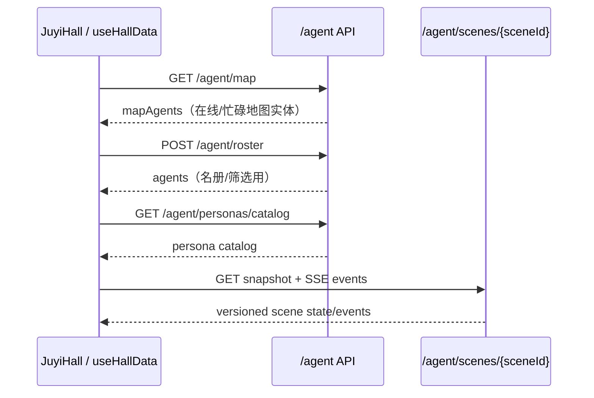

# 聚义厅端到端链路

## 页面组合

`JuyiHall.vue` 将 `HallStage`（场景）与 Agent、榜单、人格目录、公共/悬赏/私聊讨论、资料库等浮层面板组合。选择 Agent/任务是显式响应式状态；面板打开时锁定场景交互，并包含焦点管理。

## Agent 数据流

`useHallData` 只以 `/agent/map` 填充地图可见 Agent，以 `/agent/roster` 填充名册 Agent；不要使用 `/agent/active` 将两条流重新合并。场景快照和事件通过规范化 scene version 拒绝倒退或重复事件。

## 悬赏任务流

- 读取：`POST /agent/tasks/search`、`POST /agent/tasks/status-counts`。
- 创建：`POST /agent/tasks`。
- 指派：`POST /agent/tasks/{taskId}/assign`，客户端载荷显式携带 `agentId` 与 `agentIds`。
- 推荐/自动指派/归档：分别为 `recommend`、`auto-assign`、`archive` 子资源。
- 客户端对业务结果码做二次判断；成功后局部更新任务和 Agent 状态，再由刷新校正。

Agent schema 中的 `agent_task_meta`、`agent_task_member`、`agent_task_work_item`、`agent_task_request`、`agent_task_artifact`、`agent_task_note` 是该协作域的持久化线索。协作迁移加入 mode、risk、max agents、coordinator、review required 与 aggregate/event version 等字段。

## 对话和事件流

`useHallConversation` 通过 `POST /chat/stream` 发送内容，并通过 `GET /chat/conversation/events?id=...` 消费 SSE。Chat 后端同时有 conversation list/content/update/delete、library search/documents，以及任务团队线程接口。后端 Chat 服务使用流式 AI 响应、会话持久化和聚义厅 scope；客户端处理 event payload、增量消息、流终止和恢复状态。

后端场景流由 `GET /agent/scenes/{sceneId}/events` 提供 SSE；支持 `sinceVersion` 和 `Last-Event-ID` 取较大游标恢复，SSE event id 为 scene version。`POST /agent/scenes/{sceneId}/phases` 上报 arrived/blocked 等阶段，并校验 report、agent、region、phase、state version 与时间。

## 变更不变量

1. 保持 map 与 roster 两种 Agent 语义分离。
2. 分配动作必须以函数参数/请求体中的目标 Agent 为准。
3. 检查 scene version、SSE 断线恢复与 feature flag 降级路径。
4. 角色显示改动应先查角色 resolver 与 constants，不在 Token/Panel 组件重复写规则。
5. 聚义厅行为改动至少检查相关 `web/tests/`，并执行有针对性的脚本或 `npm run build`。
