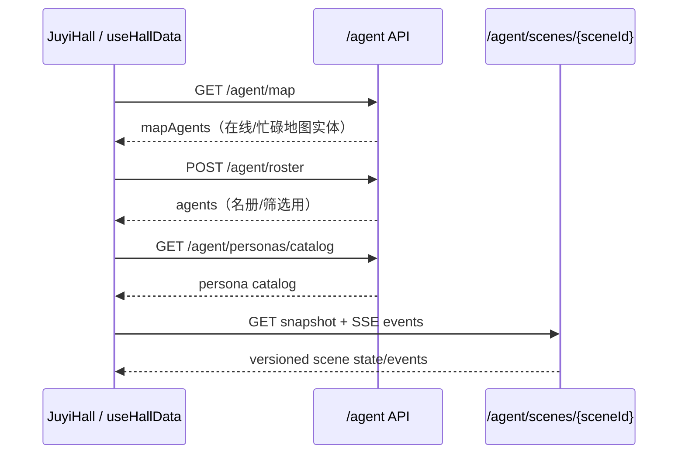

# 聚义厅端到端链路

> 有效性：原有链路章节来自 `BASELINE.yaml` 的 2026-08-15 静态基线及既有增补，本轮未全量复核。仅“议事输入区 UI”按明确源码范围更新；历史发布证据不等于当前线上状态。

## 页面组合

`JuyiHall.vue` 将 `HallStage`（场景）与 Agent、榜单、人格目录、公共/悬赏/私聊讨论、资料库等浮层面板组合。选择 Agent/任务是显式响应式状态；面板打开时锁定场景交互，并包含焦点管理。

## Agent 数据流

```mermaid
sequenceDiagram
  participant UI as JuyiHall / useHallData
  participant A as /agent API
  participant Scene as /agent/scenes/{sceneId}
  UI->>A: GET /agent/map
  A-->>UI: mapAgents（在线/忙碌地图实体）
  UI->>A: POST /agent/roster
  A-->>UI: agents（名册/筛选用）
  UI->>A: GET /agent/personas/catalog
  A-->>UI: persona catalog
  UI->>Scene: GET snapshot + SSE events
  Scene-->>UI: versioned scene state/events
```

`useHallData` 只以 `/agent/map` 填充地图可见 Agent，以 `/agent/roster` 填充名册 Agent；不要使用 `/agent/active` 将两条流重新合并。场景快照和事件通过规范化 scene version 拒绝倒退或重复事件。

## 悬赏任务流

- 读取：`POST /agent/tasks/search`、`POST /agent/tasks/status-counts`。
- 创建：`POST /agent/tasks`。
- 指派：`POST /agent/tasks/{taskId}/assign`，客户端载荷显式携带 `agentId` 与 `agentIds`。
- 推荐/自动指派/归档：分别为 `recommend`、`auto-assign`、`archive` 子资源。
- 客户端对业务结果码做二次判断；成功后局部更新任务和 Agent 状态，再由刷新校正。

Agent schema 中的 `agent_task_meta`、`agent_task_member`、`agent_task_work_item`、`agent_task_request`、`agent_task_artifact`、`agent_task_note` 是该协作域的持久化线索。协作迁移加入 mode、risk、max agents、coordinator、review required 与 aggregate/event version 等字段。

## 对话和事件流

`useHallConversation` 通过 `POST /chat/stream` 发送内容，并通过 `GET /chat/conversation/events?id=...` 消费 SSE。Chat 后端同时有 conversation list/content/update/delete、library search/documents，以及任务团队线程接口。后端 Chat 服务使用流式 AI 响应、会话持久化和聚义厅 scope；客户端处理 event payload、增量消息、流终止和恢复状态。

后端场景流由 `GET /agent/scenes/{sceneId}/events` 提供 SSE；支持 `sinceVersion` 和 `Last-Event-ID` 取较大游标恢复，SSE event id 为 scene version。`POST /agent/scenes/{sceneId}/phases` 上报 arrived/blocked 等阶段，并校验 report、agent、region、phase、state version 与时间。

## 变更不变量

1. 保持 map 与 roster 两种 Agent 语义分离。
2. 分配动作必须以函数参数/请求体中的目标 Agent 为准。
3. 检查 scene version、SSE 断线恢复与 feature flag 降级路径。
4. 角色显示改动应先查角色 resolver 与 constants，不在 Token/Panel 组件重复写规则。
5. 聚义厅行为改动至少选择相关 `web/tests/`，并让精确远端提交在前端 Flow CI-only 通道执行定向测试和生产构建；本地脚本仅辅助诊断。

## 议事输入区 UI（2026-10-08 局部收口）

### 来源与范围

- 源码核对：Web `75766a3b78c2e552ef448e924a813ed2dfc7ecd4` 的 `ChatPanel.vue`、`HallChatComposer.vue`，并与发布提交 `ee6ca1b6beba562e0c7fa13d422857f554644471` 对比。核对的是本地 Git 对象，不是新发布或实时线上复验。
- 历史交付：前端 1.0.6 / Flow 4403172 Run180 的 UI-only 发布；[版本记录](../../specs/juyiting-ui-baseline-20261006/release-1.0.6.md)及其 release、artifact、online、browser JSON 对应版本/commit/Run 一致。本次只读取记录，不重复运行所记测试。
- 局部 UI 已交付不代表整套业务验收完成；原记录的 R01、重复正文、完成态恢复待办不在本次重新判定。后续源码的局部修复也不自动证明整个待办已关闭。

### 稳定行为与边界

1. 话头工具栏承载重取回话、话头记录、另起话头；这些入口仍向上传递各自事件，不因图标化合并业务语义。
2. 输入区保留“更多、添加资料、语音、发送”；资料可直接打开，不需要先打开更多菜单。资料区域使用独立 materials 插槽，菜单收起不等于资料选择器隐藏。
3. 更多菜单展示语音设置；`moreOpen || voiceHasDetail` 保证非空闲语音反馈不只依赖菜单打开。保留处理状态、取消、错误和输入禁用语义，不为界面简化移除反馈。
4. 空闲图标采用 20px SVG、1.8px 描边、38px 点击区；图标按钮保留可访问名称。三种议事复用面板/输入组合，不另建一套纯外观业务分支。
5. **后续源码边界（非 1.0.6 新增）**：`bounty` 且服务端任务状态为 `completed` 时，ChatPanel 锁定输入/相关动作并关闭资料选择器；身份、任务或会话切换也重置资料选择状态。UI 外观修改不能删掉这些保护；本文不将客户端禁用等同于服务端授权检查。

### 后续改动的最短验证路径

- 先查 `web/tests/juyiting-composer-more-menu.test.js`、`web/tests/juyiting-voice-conversation.test.js` 及目标行为相关用例；保留真实事件、可访问名称、禁用状态和资料入口断言，不只匹配可见文案。
- 布局诊断覆盖桌面、手机与窄屏，资料直接打开、更多关闭、语音进行中、任务完成和上下文切换；历史 1440/390/320 记录是复测参考，不是新候选已通过证据。
- 前端正式验证仍使用 Flow 的精确候选；本地仅开发预览/低成本诊断，不本机生产构建。UI 与真实发送、录音、Provider 调用和完整任务交付验收分开。

组件职责见 [前端架构](05-frontend-architecture.md#hall-discussion-composition)；原型、实施经过与原发布证据只在 [历史来源导航](../../specs/juyiting-ui-baseline-20261006/README.md)按需追溯，不作为日常开发必读。
