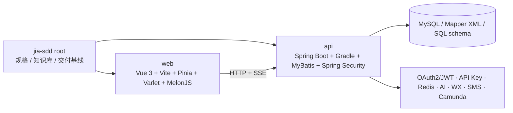

# 系统总览

## 组成

CYF 是一个以 Java/Spring Boot 后端和 Vue 3 前端构成的模块化系统。根仓只承担 SDD 规格、知识、运维资料和已验证的子仓版本组合；可运行实现位于两个 submodule：

## 后端能力域

`api/settings.gradle` 注册 17 个一级领域：`common`、`base`、`dwz`、`isp`、`kefu`、`material`、`oauth`、`point`、`sms`、`task`、`user`、`workflow`、`wx`、`chat`、`agent`、`starter` 及 `plugin`。典型领域层次是 `core → api → service → mapper → starter`；并非每个领域都完整拥有所有层。

运行装配入口是 [`api/starter/src/main/java/cn/jia/JiaApplication.java`](../api/starter/src/main/java/cn/jia/JiaApplication.java)：Spring Boot、事务、异步、调度和 `cn.jia.*.mapper` Mapper 扫描均在此启用。`api/starter/build.gradle` 组合大部分领域 starter/service/mapper，并明确包含 chat 与 agent。

## 前端能力域

`web/src/main.js` 装配 Vue、Varlet、Pinia、Vue Router、i18n 和 PWA。路由根路径重定向到 `/juyiting`，同时保留 chat、传统任务、礼品/积分、消息、帮助、投票、短链和微信管理页面。前端共享请求层在 [`web/src/composables/useHttp.js`](../web/src/composables/useHttp.js)。

聚义厅是当前跨仓集成最密集的域：Vue 面板层、MelonJS 场景层、Agent 任务/人格/场景 API、Chat/SSE 和持久化协作模型同时参与。

## 关键边界

- `api/` 与 `web/` 有各自 Git 历史；根提交只钉住两者的提交版本。
- 聚义厅 **map agents** 来自 `/agent/map`，**roster agents** 来自 `/agent/roster`；两者是有意分离的数据流。
- 聚义厅不得重新依赖 `/agent/active`，即使后端仍存在该兼容/其他用途控制器。
- 任务指派必须携带显式目标 Agent，不可依赖隐藏选中状态。
