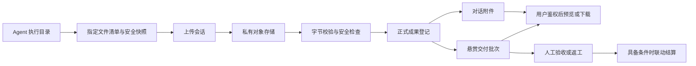

# 产物交付总体设计

状态：Draft；本文是总体约束，实施细节及R1/R2范围以 [detailed-design.md](detailed-design.md) v1.1 为准，计划见 [execution-plan.md](execution-plan.md)。新增接口/字段尚未实现。

## 1. 架构与边界

共用文件存储、校验、下载、预览和前端组件，保留不同业务的权限与状态。Agent 主动向平台上传，用户取件不依赖 Agent 在线，也不要求在用户电脑开入站端口。WebSocket/SSE 承载元数据、回执和刷新事件；文件字节走 HTTPS，不把大文件 base64 塞进聊天或任务事件。

一期由后端以流方式接收字节、计算 SHA-256 并写私有对象存储，减少将存储凭据交给客户端的复杂度；不把整个文件读入 JVM 内存。二期按需要加入限对象、限时、限大小的预签名上传/分片上传；两条上传路径使用相同完成校验与业务登记规则。

## 2. 客户端采集：发布产物而非同步目录

1. 可信执行消息带 `runId`、真实任务/会话关联和交付要求。不能把客户端 `taskId` 的 command/message fallback 当成真实任务关联。
2. 提供 `publish_output` 工具或本地 CLI 辅助命令；工具提交相对路径、展示名、说明、用途。也支持受版本约束的 manifest，不能靠解析自然语言回复里的绝对路径确定交付物。
3. 默认导出 `outputs/<runId>/` 内的显式文件；已有文件允许通过受信配置的导出根按用户请求选择。排除 `.git`、密钥、`.env`、运行日志、依赖缓存；不自动把整个仓库打包。
4. 对路径逐级进行不跟随符号链接的访问，检查根目录身份、普通文件类型、size/数量、路径穿越、设备/FIFO；不能仅靠字符串前缀或一次 `realpath` 检查。借鉴现有安全目录访问实现，专门验证导出读操作。
5. **释放 workspace lease 前**建立私有、不可变的上传快照并计算摘要；随后释放执行锁，以快照上传。当前 `finish` 会先释放锁，实施时必须调整顺序。对聊天模式也要有独立 run 目录/读快照边界，不能只保护 command 模式。
6. 对同一 inode 的并发原位写入，前后 stat 只能辅助检测；需要隔离执行目录、等待写入任务结束、拒绝检测到变化的文件，并让用户取到的快照哈希成为最终字节事实。哈希不证明内容业务正确。
7. 将待上传清单、快照位置、上传会话、幂等键和已确认版本写入本地持久队列。重启后继续上传，不通过重跑模型重建文件；平台确认 READY 与正式登记后，按配置清理本地快照。
8. 执行成功但上传失败时显示「执行结束，成果待同步」。不能发送暗示交付完成的成功回报。兼容旧协议时，只有不要求文件交付的旧任务仍走 legacy 完成语义。

代码产物建议组合：变更说明、`git diff --binary` 补丁、显式新增文件、base/head commit、测试证据和应用方式。已提交变更与未跟踪文件要分别处理；只对工作树执行一次 diff 可能丢失它们。用户授权后可附 PR/commit 链接，但平台不把无访问权限的仓库链接当成完整交付。

## 3. 数据结构与事实源

不把任务专用表的 `taskId` 简单改为可空来容纳普通对话。采用共享字节对象 + 各领域版本引用，统一服务是接口与基础设施的复用。

| 对象 | 新增/复用 | 核心字段与职责 |
| --- | --- | --- |
| `output_upload_session` | 新增 | scope、上传身份、run/source 关联、期望大小/哈希、幂等键、到期、状态、objectId；一次上传的持久进度 |
| `output_object` | 新增 | objectId、scope、bucket/key、存储对象版本、服务端 sha256/size/MIME、安全检查状态、创建/保留时间；不可变字节事实 |
| `output_source_binding` / `output_run_binding` | 新增 | 前者固定 sourceType/sourceId、scope、ownerJiacn；后者固定 runId、source、producer/binding/runtime、command或消息关联、有效期；由服务端创建，不接受客户端自报归属 |
| `output_object_reference` | 新增 | objectId、业务来源/确切版本、状态、retainUntil、hold、短期读取 pin；对象存活与引用过期的持久依据 |
| `agent_task_artifact` | 复用并扩展 | 继续拥有任务成果 ID/version；可选 objectId、来源 runId、原文件名及大小/MIME 展示信息。正文/受管对象/历史外链互斥，DDL 与服务验证同时修改 |
| `chat_output` | 新增 | scope、conversationId、runId、outputId/version、producer、正文或 objectId、展示名、创建时间；独立于可变的消息正文 |
| `task_delivery` | 新增 | taskId、deliveryId、revision、summary、status、submittedBy、submittedAt、expectedTaskVersion；不可变交付批次 |
| `task_delivery_item` | 新增 | deliveryId、artifactId、artifactVersion、contentHash、用途；冻结确切版本，禁止验收时读取 latest 替换 |
| `task_delivery_review` | 新增 | deliveryId、验收人、结论、原因、时间、版本和幂等键；保留返工/验收审计 |

每个对象和引用均带现有 `tenant_id/client_id` 范围；用户身份映射见第 6 节。不跨 scope 做可探测的内容去重。字节内容的真实 hash/size 由服务端或受信校验器提供，不能把客户端声明当成验证结果。

任务版仍由 `agent_task_artifact` 唯一版本约束和事务拥有；普通对话由 `chat_output` 拥有版本。跨业务展示使用统一 DTO，避免建设两个互相竞争的成果版本事实源。聊天只保存成果引用，重新加载时服务端重新鉴权，不信任消息 metadata 中任意 objectId。

一期暂不做通用多父对象分享。任务成果出现在相关会话中时，仅以原任务成果的引用卡片展示，继续按任务交付 ACL 读取，不自动复制为会话所有者可读的附件。

## 4. 上传、事件和一致性

上传状态：`CREATED → UPLOADING → VERIFYING → READY`；失败分为可重试上传失败、`REJECTED`（完整性/安全检查不通过）、`EXPIRED`。对象不可用时，成果不得伪装为可下载。

对象的校验与删除分开持久化：`verificationStatus=PENDING/PASSED/REJECTED`，`lifecycleStatus=STAGED/READY/DELETING/DELETED`；只有 PASSED 且 READY 才能创建引用或取件。对象删除后保留 ID/hash/删除时间的 tombstone，不保留可用 URL，不删除验收审计。

登记过程：

1. 校验 Agent 当前绑定、运行来源及任务/会话关系，创建受限上传会话。
2. 上传暂存对象；服务端测量真实大小、hash、类型并做安全检查。具体检查器需在部署中落实，不能默认已有杀毒设施。
3. 对象 READY 后，短事务中插入业务成果版本、引用对象、保存幂等回执并写事件。对象与 MySQL 不做伪分布式事务；先存对象后登记，失败后可用同一幂等键重试。
4. 对象清理和成果引用建立必须用同一对象行的锁/CAS 协议互斥。GC 先将未引用且过期对象标记 `DELETING` 再删除；新引用只接受 READY，避免“刚登记的文件被 GC 删除”。
5. 任务发布复用任务根锁、版本校验和持久事件机制；首发由HTTP成果/租约/提交接口接应用服务；WS artifact.publish/work.result仍保持未开放，也不公布其能力。未来提供同义WS适配时必须共用幂等回执和领域校验。
6. ACK 仅在业务事务提交后发送。相同 scope+actor+操作+幂等键且相同正文返回原回执；同键异参返回冲突。丢失 ACK、断线、重启不会重复创建版本/提交批次。

新任务正式提交还依赖服务端工作项 lease，而客户端 workspace lease 只是本地文件并发锁，两者不能混用。当前 `work.progress/work.heartbeat` 入站同样未开放，因此任务阶段必须打通 claim/start/heartbeat/result 的可信执行闭环（复用 `AgentWorkItemLeaseService`），并把最新工作项版本/令牌带入结果提交。上传阶段不能无限续租：有界续租到提交期限，失效后文件可保留但不得占用旧 lease 强行提交。若 A 阶段发现其传输依赖未满足，先交付对话取件，调整悬赏阶段工作量，不绕过租约校验。

上传会话与业务登记分别幂等；不使用 contentHash 作为唯一业务幂等键，同样文件可以是两个不同任务的合法交付。

引用与保留的具体规则：业务版本引用使用 `ACTIVE/EXPIRED/RELEASED`，到期释放的是该版本的取件权与存活引用，不会删除其他来源仍引用的字节。SUBMITTED 批次建立不可由生产者撤销的 delivery pin，覆盖验收/返工处理期；ACCEPTED 将 pin 延长至验收时间后至少 90 天。争议 hold 覆盖时间到期，解除须持久审计；用户普通删除不能释放 delivery pin/hold。EXPIRED 版本对已授权用户返回 410，即使同一对象因其他引用仍保留，也不会借此恢复它的下载权。

所有引用创建、到期、pin/hold 设置与解除，都必须锁住对应对象行。涉及业务状态时统一锁序为「source 根（任务根或会话来源绑定）→ delivery（如有）→ objectId 排序后的对象行 → 引用行」；GC 只锁对象及引用，不反向获取业务根锁。GC 在对象锁内确认没有有效 ACTIVE 引用、delivery pin、hold 或读取 pin，CAS 标记 DELETING 后提交，再幂等删除外部对象并标记 DELETED；删除失败重试，DELETING 不再接收新引用。并发设置 hold 若已进入 DELETING，明确返回 409/保全失败并告警，不能承诺保存成功。下载鉴权后建立覆盖本次传输/签名 TTL 的短期读取 pin，避免到期清理切断已授权取件。清理任务不能直接依据对象 createdAt 或“业务行存在与否”物理删除。

新增事件只带 `sourceType/sourceId/outputId/version/status` 等可鉴权的摘要，不带正文、对象 key、本地绝对路径或签名 URL。复用任务事件时同步更新类型枚举、payload 验证器、投影、回放和 Web reducer，不能只增加发送代码。事件作为刷新提示，文件列表 API 是重连后的事实源；保留现有事件版本/游标语义。

对话先采用可靠列表查询 + 轻量事件触发刷新，不假定当前对话事件已有任务事件同等的持久重放能力。列表分页使用稳定 `(createdAt,id,version)` 游标、明确排序和截断提示，不受工作台 recent 100 条限制。

## 5. HTTP 与协议契约草案

路径为新增设计，相对当前 API 基址；JSON 接口沿用项目统一响应封装，表中列业务 data 字段。所有浏览器接口使用 JWT；Agent 写入使用已验证的专用凭据或由现有绑定 WS 会话交换的短期上传凭证，不能把任意 AgentId/API Key 字符串当作授权。

| 方法/路径 | 请求 | 响应/行为 |
| --- | --- | --- |
| `POST /agent/output-uploads` | `runId, source:{type,id}, name,size,sha256,mime` + `Idempotency-Key` | `uploadId, uploadUrl, expiresAt, maxBytes`；后台固定 scope/producer/关联 |
| `PUT /agent/output-uploads/{uploadId}/content` | 文件字节、受限上传凭证 | 流式接收；一期失败重传整文件，相同已验证字节可返回成功 |
| `POST /agent/output-uploads/{uploadId}/complete` | 幂等键 | `uploadId,status,objectId?`；校验中 202，READY 后才返回可登记对象 |
| `GET /agent/output-uploads/{uploadId}` | 原上传身份 | 上传状态和失败原因；不暴露存储密钥 |
| `POST /agent/tasks/{taskId}/artifacts` | 现有 publish 版本字段 + 正文或 `objectId`、可信运行关联 | 正式成果确切版本；Agent 成员/生产者授权；HTTP首发；未来WS适配共用同语义服务 |
| `GET /agent/tasks/{taskId}/artifacts` | `cursor,limit` | 用户可见成果摘要、版本、size、MIME、state、下一页游标 |
| `GET /agent/tasks/{taskId}/artifacts/{artifactId}/versions/{version}` | 用户 JWT | 详情、正文或受控预览能力；不输出内部 URI |
| `GET /agent/tasks/{taskId}/artifacts/{artifactId}/versions/{version}/download` | 用户 JWT | 再鉴权后流式下载或 302 短期受限 URL |
| `POST /chat/conversations/{conversationId}/outputs` | `runId,outputId,expectedPreviousVersion,正文或objectId,展示信息` | 对话产物版本；需可信执行绑定，客户端不可随意选择 conversationId |
| `GET /chat/conversations/{conversationId}/outputs` | `cursor,limit` | 会话所有者可见的列表 |
| `GET /chat/conversations/{conversationId}/outputs/{outputId}/versions/{version}` | 用户 JWT | 指定版本详情/正文/预览能力 |
| `GET /chat/conversations/{conversationId}/outputs/{outputId}/versions/{version}/download` | 用户 JWT | 再鉴权后取件 |
| `POST /agent/tasks/{taskId}/deliveries` | `expectedTaskVersion,summary,items:[{artifactId,version}],workItem/lease上下文` + 幂等键 | 固定批次、revision、状态；要求所有文件已 READY 且可交付给发布人 |
| `GET /agent/tasks/{taskId}/deliveries` | 用户 JWT、分页 | 批次、文件版本、验收记录和可执行动作 |
| `POST /agent/tasks/{taskId}/deliveries/{deliveryId}/review` | `decision:accept/request_changes,reason,expectedDeliveryVersion,expectedTaskVersion` + 幂等键 | 新版本、验收结果；仅发布人或明确授权验收人 |

首期下载流接口就是最小完整能力；v1.1预览仅用已鉴权Blob实现受限文本/位图，PDF及其他格式先只下载。视频 Range、隔离预览域和额外衍生文件接口在启用相应格式时增加，不对一期未实现的预览能力返回可用标记。

统一错误：400 参数/格式；401 未登录；403 凭证缺乏操作能力；404 对不存在或不可见资源统一回应；409 版本、状态或幂等冲突；413 大小超限；415 不支持类型；422 hash 不匹配/交付要求未满足；429 频率/配额限制；503 存储或验证器暂不可用。仅已获资源权限者可收到 410 到期删除；轮询 VERIFYING 使用正常状态响应，浏览器禁止把校验中当成失败后重新执行任务。

新协议能力独立协商，例如 `output.upload.v1`、`output.chat.v1`、`task.delivery.v1`。消息类型常量存在不代表能力已实现。服务端仅在处理器与依赖就绪时公布支持；不要求更换整个 Agent 协议版本。`command.ack` 只证明命令接收，不能当成文件交付或用户验收。

## 6. 权限与内容安全

现有代码常以当前 `jiacn` 作为 `tenantId`，同时受 `client_id` 限制；不能凭命名假设另有组织租户或多人共享模型。第一期沿用现有作用域，将任务创建者/会话所有者作为用户授权主体，来源必须是已认证上下文和服务端持久关联。若未来拆分组织租户与个人身份，另行迁移。

授权主体在一期锁定为经过校验、保持原值的 `(jiacn,client_id)`；持久 scope、ownerJiacn、资源 ID 使用字节精确比较，不进行 trim、大小写折叠或依赖数据库默认不区分大小写的 collation。缺少任一身份 claim 直接拒绝。新会话/任务的 `output_source_binding.ownerJiacn` 在创建时从认证主体写入且不可由产物请求覆盖；旧会话通过 `ChatConversationDao.findScopedById` 的精确 scoped 路径核对持久 `jiacn/clientId`，**不能复用普通会话通用 get/requireGenericConversation 作为新产物授权检查**。旧任务仅在 scoped task root 与 TaskPlan 的持久创建归属一致且唯一时回填来源绑定；无法证明则标记 ownership_unresolved，不猜测为当前访问者或所选 Agent 的 owner。

每次产物请求均比较认证主体、来源绑定及业务资源的精确归属。Agent 的 `output_run_binding` 由服务端在可信命令/会话执行派发时创建，绑定服务端已授权 source 和当时 Agent binding/runtime；上传与登记都核对该记录及当前有效身份。没有可信 run 记录的普通对话执行必须先补执行关联，不能以客户端自造 runId 或 metadata 中的 conversationId 代替。历史补交由已认证来源所有者发起专用授权，绑定指定文件/范围和执行者，保留补交审计。

历史 `tenant_id='0'` 或缺失 scope 不能被视为公共数据或当前用户数据。仅在有唯一持久归属证据时通过专门迁移关联；否则不开放产物读取/补交登记，并列入待核实清单。

实现精度要求：现有 `ChatConversationDao.findScopedById` 的 scoped SQL 不能单独充当上述完整授权证明，它只比较 tenant/client，包含 `tenant_id='0'` 兼容分支且未直接比较 `chat_conversation.jiacn`。产物路径需新增严格查询或在返回行上再次检查 tenant/client/jiacn 的字节精确归属并拒绝 `'0'` 兼容结果；不能仅因为方法名含 scoped 就放行。

| 主体 | 读取范围 | 写入/验收范围 |
| --- | --- | --- |
| 对话所属用户 | 自己会话明确发布的产物 | 取件；管理自己的保留策略（受保全约束） |
| 悬赏发布用户 | 已明确面向发布人提交的交付版本 | 验收、要求修改；无需提供 actorAgentId |
| 执行 Agent | 自己产物、任务授权给它的协作内容 | 只能发布当前可信运行产生或显式授权补交的内容 |
| 审核 Agent | 现有 reviewer/task_members 规则允许的成果 | 内部审核意见；不自动拥有用户资金验收权 |
| 其他用户/Agent | 无授权则不可见 | 不能从榜文可见性推导文件可见性 |

保留 `private/reviewer/task_members` 的内部协作语义。用户能读最终交付来自**显式 delivery 引用授权**，不能让“拥有这个 Agent”或“同一 scope”自动打开全部私有中间资料。提交时生产者确认可交付范围；协调者如要提交他人的私有/审核专用内容，须先取得明确发布授权或由生产者生成可交付版本。

授权在列表、详情、预览、下载和事件投影一致执行。objectId/uploadId 均不可单独获得读写权。Agent 解绑后撤销新增上传能力；用户已收到的正式交付不会因解绑或成员退出消失。失效旧租约不能成为正式结果；可按原始所有权保存候选文件，但需经新有效执行/人工补交授权才能提交。

下载采用 `Cache-Control: private, no-store`、正确的 `Content-Disposition` 和 `nosniff`；签名 URL 建议 60～300 秒，不写消息/事件/日志。签名生成后撤权有 TTL 窗口，必须秒级撤销的内容使用鉴权代理下载。

Markdown 清洗 HTML；HTML/SVG/脚本/Office 宏不在主站同源直接执行。v1.1第一期拒绝HTML/SVG，允许的Office/ZIP扫描后默认只下载；ZIP 不在应用进程解压。若新增隔离预览或解压，补充脚本禁用、资源隔离、解压炸弹、路径穿越及资源上限。文件名/标题也按不可信输入处理。

对历史 `storageUri` 不直接做后端任意 URL 抓取，不向前端透传可能含凭证的 URI。只对受管存储或明确 allowlist 的导入任务校验网络目的地、重定向、hash、大小并复制到私有对象。无验证证据的旧外链标记为「外部引用，未托管」，不能用于满足要求可下载文件的验收条件。

## 7. 悬赏交付状态与结算边界

保持既有工作项 `running → submitted → completed` 的含义，新增交付批次状态 `SUBMITTED → ACCEPTED / CHANGES_REQUESTED`。一期只有提交成功才持久创建 delivery；提交前的草稿/上传清单保存在客户端，不提供服务端 DRAFT 状态或草稿 CRUD。返工创建新 revision，不改写旧批次。任务总体 UI 可投影为「执行中、上传中、待验收、待修改、已验收」；不直接把这些字符串写入现有 `rewardStatus` 枚举。

任务发布时增加交付要求：类型、必要内容/文件、说明和验收方式。默认普通文件悬赏由人验收；明确声明的低风险自动验收需有可执行规则和审计，Agent 自报测试通过不等于用户接受。

提交事务校验任务根版本、有效 lease/workItem、交付文件 READY、确切版本与 hash、发布权限、必需交付要求；冻结清单，并与工作项 submitted 和任务事件原子提交。现有单 `resultArtifactId` 可指向一个内联「交付清单成果」，其正文固定 deliveryId 和各文件确切版本；新增明确 `resultDeliveryId` 引用用于结构化查询，不能只靠 latest 指针解释。

正式提交只有一个权威应用服务（拟名 `TaskDeliverySubmissionService.submit`）。首发HTTP `POST deliveries` 是唯一适配入口，未来WS `work.result` 接入时必须使用同一命令DTO、幂等记录和事务；该事务完成文件引用/冻结、delivery 创建、清单成果创建、工作项 submitted/lease CAS 和任务事件写入。复用现有 result commit 的领域校验和 DAO，不采用“先调用旧 commit 提交，再另建 delivery”的两事务接法。

R2 allowlist新建单Agent/单required work item任务在服务端持久写入 `deliveryPolicyVersion=1`；此类任务的所有完成路径都要求有效 resultDeliveryId，旧 `task.report` completed、直接旧 `AgentWorkItemResultCommitService` 单成果提交、通用状态更新和自动聚合均不能绕过。旧 result commit 对新策略任务必须委托上述唯一服务或拒绝，legacy completed 仅对明确版本 0 的历史任务开放；客户端不能覆盖策略版本。`artifact.publish` 只登记候选成果，不推进任务完成。只有当前批次的用户验收可将新策略工作项推进 completed；内部审核意见不会隐式替代该验收。

人工验收锁定相应任务根/批次，CAS 比较任务和交付版本；检查当前待验收 revision 及文件仍可用，再记录审计、推进 workItem completed 并调用现有任务聚合。已提交交付物在验收及保留期内不得由生产者覆盖或删除。二次点击、旧页验收、并发返工只能得到幂等回执或 409，不能验收到别的版本。

**执行成功、提交交付、用户验收、资金结算是四个独立事实。**当前未核实资金后端，不直接承诺改动其状态机。后续若已有托管系统，在验收事务写 outbox，结算消费者按 `(taskId,acceptedDeliveryId,settlementType)` 幂等执行；失败显示「已验收，结算待处理」，不能撤销用户已验收的文件或重复打款。

算力实际成本与悬赏报酬需分别定义。用户拒绝成果不自动意味着已发生算力成本归零；默认不因超时自动验收/退款，处理期限、争议仲裁、部分交付和多人分账需产品规则。第一期维持人工处理争议，资金功能未就绪时不展示可打款承诺。

## 8. 前端体验

- 对话：回复下方成果卡片（名称、类型、大小、版本、状态、预览、下载）；会话内有「本次成果/全部成果」入口，刷新后仍能找到。
- Agent 详情：增加「产物」入口，按用户有权访问的会话/任务聚合；不把 Agent 当前机器目录当成默认产物列表。可在第二期增加「工作空间文件」，明确在线依赖与导出边界。
- 悬赏详情：交付要求、当前交付批次、文件/文本清单、说明与验证证据、历史版本、验收/要求修改操作。即使协作工作台开关关闭，也能从榜文详情取件。
- 任务工作台：现有「最近成果」摘要接入同一成果组件，完整列表另分页获取。内部成果与正式交付有清楚标记。
- 失败提示：区分未生成、待上传、校验中、传输失败、不可预览但可下载、已到期；不能统一显示“暂无成果”。上传重试不触发模型重跑。
- 移动端/微信 WebView：一期明确支持的浏览器下载路径，真机验证文件保存与打开能力。壳环境受限时提供同账号授权的外部浏览器取件入口，令牌不进入普通分享链接；原生下载桥接、合法域名和短期 ticket 作为单独壳联调项，不能假设 H5 的 download 属性一定可用。

## 9. 兼容、历史恢复与发布

新增字段和表采用增量迁移，保留现有 task artifact ID/version 和事件序列。旧正文成果直接可读并可导出；旧外链保留引用属性但不冒充已校验文件；legacy_result 标记不能批量伪造成真实文件。先审核 schema initializer、迁移 SQL、DTO 校验和 mapper 一致性，再接入新写入路径。

历史完成任务分三类：已有正文可导出；仍在在线 Agent 工作空间的文件可经明确选择补交；本地已丢失且无备份的文件无法从“completed”状态恢复。补交为新记录，标注补交时间与来源，不倒填成历史完成时已经交付，不自动触发奖励重算。

发布次序：R1存储/读写HTTP及身份交换 → 一个测试Agent → 对话与榜文显式分享取件 → R1验收；R2租约HTTP和policy禁入 → 正式提交/验收 → 观察后扩展。旧任务按原约定显示执行状态，并另显交付可用性；新要求文件任务只派给支持交付能力的 Agent。

上传能力、用户读取能力、交付验收分别配置，避免依赖旧工作台开关。故障时可以暂停新上传/新提交并修复，保留已发布产物的读取路径；不以清空成果表、降级成 legacy completed 或删除新版本解决问题。

核心指标：执行成功但未交付数、上传成功率/耗时、校验失败率、待同步队列年龄、404/410 取件比例、GC 孤儿对象、用户验收/返工率；日志只含资源 ID、错误码和耗时，不含文件正文、签名 URL 或机器绝对路径。
